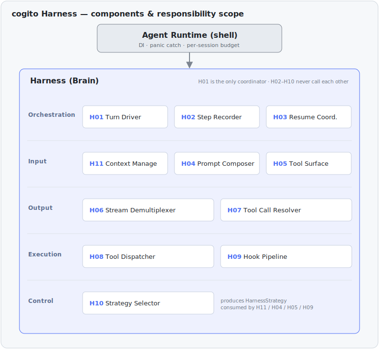
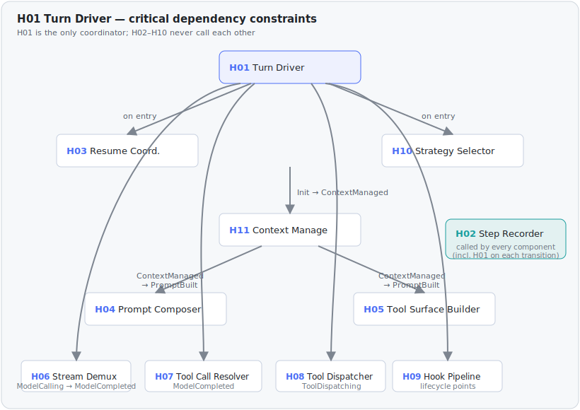
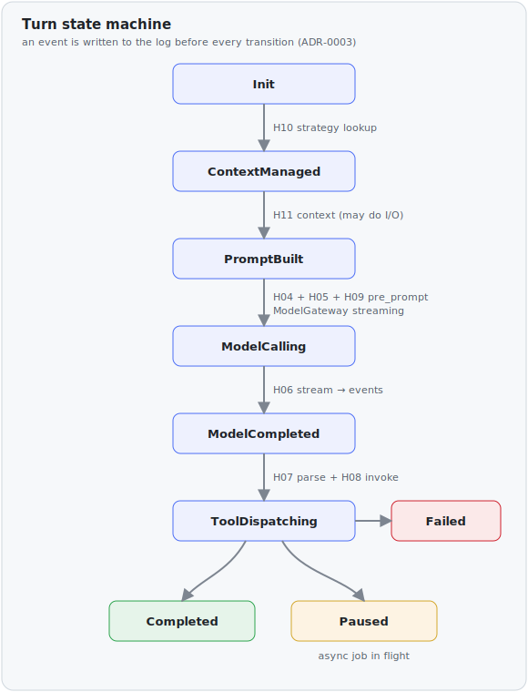
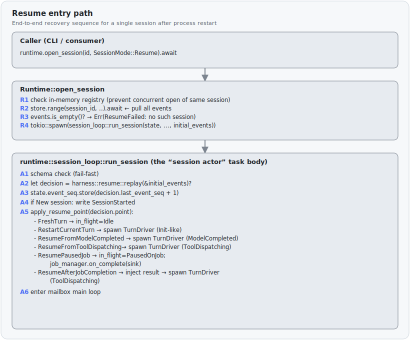
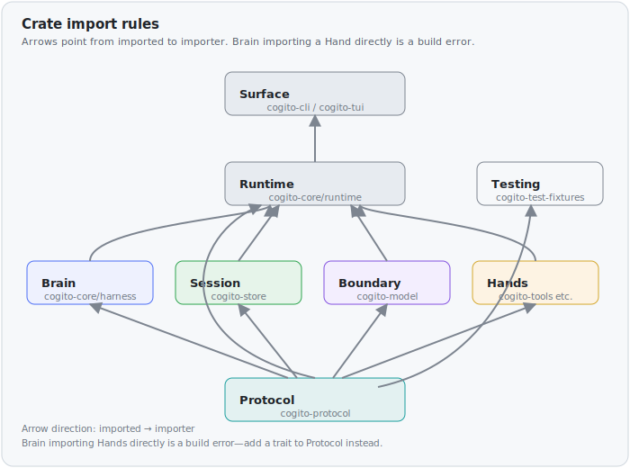
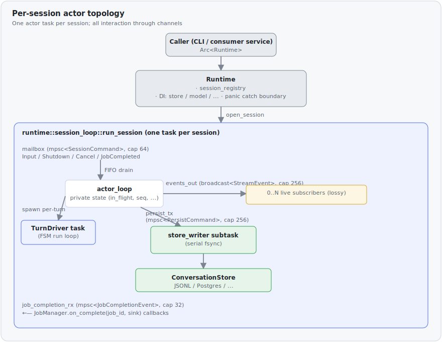

# cogito Architecture

> Production-grade Agent Runtime core, packaged as an embeddable Rust library.

## Positioning

cogito is **the core of an agent runtime — the brain of an agent — packaged
as an embeddable Rust workspace** that another Rust service depends on and
runs in-process. cogito provides:

- **Brain**: the Harness (H01–H11) that drives one iteration of the agent loop, including Context Management (H11) since v0.1 Sprint 6
- **Session contract**: the `ConversationStore` trait (event-sourced log) and a v0.1 backend (`cogito-store --features jsonl`, default)
- **Hand / Boundary contracts**: `ToolProvider`, `JobManager`, `ModelGateway`, `HookHandler`, `Compactor` / `HistoryProjector` / `SystemPromptInjector`, `SkillProvider`, `StorageSystem`, `BrainSpawner` traits with reference implementations
- **Extensibility surface**: agentskills.io-compatible Skills (v0.1 Sprint 7) + Plugin bundles (v0.2) packaging Skills + Subagents + Hooks + MCP servers as one shippable unit
- **Multimodal content**: `Vec<ContentBlock>` payloads (Anthropic Messages API shape) with URI-addressed bulk storage (`ContentBlock::Image` + `StorageSystem` land in v0.5)
- **Subagent**: minimal `delegate` tool in v0.2 → full recursive Brain hosting via a 4-tool `ToolProvider` in v0.3

cogito does **not** provide: deployment artifacts (Docker / Helm), inbound
HTTP/gRPC transport, end-user authentication, multi-tenant isolation, quota
/ billing, Web UI, RAG / vector store, or cross-session memory. Those are
the consumer's responsibility (or a future SaaS layer that wraps cogito).

The first production consumer target is **a single product feature backend**
(chat / IDE / code assistant / customer support / multimodal task agent).
Per-process replica capacity is the primary scaling unit; consumers run K
replicas behind a load balancer with `session_id` sticky routing. **cogito
does not coordinate across processes** — that is the consumer's deployment
concern.

cogito must be:

1. **Resumable** — any Brain instance can pick up any session and continue
2. **Stateless across turns** — all state in the event log
3. **Pluggable** — different stores, models, tools, strategies, storage via traits
4. **Observable** — every step recorded as an event + structured `tracing` span
5. **Recoverable** — single-session crashes are routine, never bring down the process

## The 11-component Brain



Each component has a dedicated design doc in `docs/components/H0X-*.md`.

| ID | Component | Single responsibility |
|---|---|---|
| H01 | Turn Driver | Drive one Loop iteration as an explicit FSM; the only coordinator |
| H02 | Step Recorder | Persist every step as an event, immediately |
| H03 | Resume Coordinator | Pure function: event log → resume state |
| H04 | Prompt Composer | Assemble the next `ModelInput` (passive, deterministic) |
| H05 | Tool Surface Builder | Decide which tools the LLM sees this turn (strategy-static) |
| H06 | Stream Demultiplexer | Split streaming response into typed events |
| H07 | Tool Call Resolver | Parse and schema-validate model-emitted tool calls |
| H08 | Tool Dispatcher | Invoke `ToolProvider::invoke`; route on the outcome |
| H09 | Hook Pipeline | Brain-side policy gates (Allow / Modify / Reject). Lifecycle timeline + extension recipe in `docs/components/H09-hook-pipeline.md` §"Component relationships" / §"Future expansion". |
| H10 | Strategy Selector | Produce the `HarnessStrategy` value for this turn |
| H11 | Context Manage | Decide context shape: compaction, system-prompt injection, tool-filter overrides; **only Brain component allowed to do I/O for summarization** (slot reserved 2026-05-19; mechanism pending ADR-0008) |

## Critical dependency constraints



**Critical rule**: H01 is the only coordinator. H02–H10 never call each other.

## Turn state machine



Each transition writes an event to the event log **before** moving on
(ADR-0003). H03 reconstructs state by replaying the log.

**What is a finite state machine in cogito?** See
`docs/components/H01-turn-driver.md` §"What is a Finite State Machine
here?" for a primer covering the states-as-values model, the
"event-before-transition" invariant, and why this design substitutes
for cross-turn state. The Rust realization (typed-state enum
`TurnState`, single-`run()` match loop, free transition functions per
state) is sized for Sprint 2 / 3 implementation; the Sprint 2 design
discussion that locked these choices lives in
`docs/superpowers/specs/2026-05-19-sprint-2-minimal-loop-design.md` §Q5.

**`ContextManaged` state** was added 2026-05-19 by PR #6 as an ADR-0006
amendment. v0.1 Sprint 2 implements it as a pass-through (H11 not yet
implemented; immediately transitions to `PromptBuilt`). The real H11
implementation lands with the Context Management initiative (ADR-0008,
pending). See `docs/components/H01-turn-driver.md` §"Init → ContextManaged
→ PromptBuilt sequence" for the canonical H10/H11/H04/H05/H09 walkthrough.

### Resume entry path

End-to-end recovery sequence for a single session after process restart:



<details><summary>Text version</summary>

```text
┌─ Caller (CLI / consumer) ──────────────────────────────────────────────┐
│   runtime.open_session(id, SessionMode::Resume).await                  │
└──────────────────┬─────────────────────────────────────────────────────┘
                   │
                   ▼
┌─ Runtime::open_session ────────────────────────────────────────────────┐
│  R1 check in-memory registry (prevent concurrent open of same session) │
│  R2 store.range(session_id, ..).await   ← pull all events              │
│  R3 events.is_empty()? → Err(ResumeFailed: no such session)            │
│  R4 tokio::spawn(session_loop::run_session(state, ..., initial_events))│
└──────────────────┬─────────────────────────────────────────────────────┘
                   │
                   ▼
┌─ runtime::session_loop::run_session (the "session actor" task body) ───┐
│  A1 schema check (fail-fast)                                           │
│  A2 let decision = harness::resume::replay(&initial_events)?           │
│  A3 state.event_seq.store(decision.last_event_seq + 1)                 │
│  A4 if New session: write SessionStarted                               │
│  A5 apply_resume_point(decision.point):                                │
│     - FreshTurn                → in_flight=Idle                        │
│     - RestartCurrentTurn       → spawn TurnDriver (Init-like)          │
│     - ResumeFromModelCompleted → spawn TurnDriver (ModelCompleted)     │
│     - ResumeFromToolDispatching→ spawn TurnDriver (ToolDispatching)    │
│     - ResumePausedJob          → in_flight=PausedOnJob;                │
│                                  job_manager.on_complete(sink)         │
│     - ResumeAfterJobCompletion → inject result → spawn TurnDriver      │
│                                  (ToolDispatching)                     │
│  A6 enter mailbox main loop                                            │
└────────────────────────────────────────────────────────────────────────┘
```
</details>

**Key invariants** (correctness requirements, not preferences):

- **Step R2 completes entirely in the Runtime layer**, before the per-session loop task starts. Once `run_session` begins, it never goes back to the store to pull history. This guarantees that the `events → state` mapping in `run_session` is a deterministic pure function (unit-testable in isolation).
- **Step A3 must precede step A5**: any write that occurs before the sequence generator is initialized may produce an event with `seq < last_event_seq`, violating the ADR-0002 append-only invariant.
- **`ResumePausedJob` branch does not spawn a `TurnDriver`**. The turn deliberately paused waiting for an external job, not for the model; spawning a `TurnDriver` immediately would cause it to terminate at once, leaving the actor to register `on_complete` on the next cycle — a bug incubator.
- **`ResumeAfterJobCompletion` is a distinct branch** (not a sub-case of `ResumeFromToolDispatching`): the former derives its completed payload from a `JobCompletedRecorded` event; the latter derives from a `ToolResultRecorded` event — the data sources are different.

> Full algorithm: `docs/components/H03-resume-coordinator.md`. Decision rationale: spec 2026-05-20-sprint-3-resume-coordinator-design.md §3 + §4.

## Brain / Hands / Session boundaries

The 11-component design describes Brain's internal structure. The **crate
graph** encodes the larger decoupling. **ADR-0004 is the authoritative spec;
this section is a summary.**

### Layer responsibilities

- **Brain** decides. No syscalls, no network, no filesystem. Reads from
  Session, calls Boundary and Hands only through trait objects supplied by
  Runtime.
- **Session** persists. Append-only event log. Single source of truth for
  cross-turn state (ADR-0002).
- **Boundary** is Brain's interface to the external thinking-aid (the LLM).
  Not Hands — Hands act on the world; Boundary lets Brain think.
- **Hands** execute side effects. Each Hand crate implements a trait defined
  in Protocol.
- **Runtime** hosts Brain instances: dependency injection of Session /
  Boundary / Hands into Brain, panic-catch boundaries, per-session resource
  budgets, implements `BrainSpawner` for subagent execution.
- **Protocol** is the only crate every other crate may depend on. It holds
  traits, event types, and shared value types.
- **Surface** wires everything into an entry point (CLI / TUI / consumer's
  service).

### Import rules



(Arrows point from imported to importer.) **Brain importing a Hand
directly is a build error.** When Brain needs a new capability, add a
trait to Protocol — do not relax the rule.

## Actor model — why and how

### Why an actor model?

cogito is an embedded library (ADR-0005 §1); a single process must serve
≥1000 concurrent sessions (ADR-0005 §3 SLO). This constraint directly
eliminates the Codex-style `Arc<Session> + Mutex<ActiveTurn>` shared-state
approach — once a mutex is poisoned inside one session, every code path
accessing the same mutex stalls, violating the "single-session failure
isolation" requirement.

Five concrete constraints drive the design toward an actor model:

- **Failure isolation**: a single-session panic must not affect other sessions.
- **Caller-injected tokio `Handle`**: cogito does not call `Runtime::new()`; it accepts an external `Handle`.
- **Cooperative cancellation**: Ctrl-C terminates the current turn, not the session.
- **Dual event streams**: the durable stream (backpressure) and the broadcast stream (low-latency, lossy) have contradictory delivery contracts that cannot share one channel.
- **Async job wake-up**: the actor must respond to mailbox messages while in `PausedOnJob` state.

All five constraints point to the same solution: one actor task per session.

### Four core invariants

cogito's actor model is defined by four invariants. These are correctness
requirements, not engineering preferences:

1. **Private state**: each session's runtime state is owned exclusively by **one** task. No cross-actor `Arc<Mutex<_>>`.
2. **Message-driven**: all interaction with an actor goes through channels — mailbox (commands), broadcast (events), persist (durable writes), job sink (async wake-up). A direct function call into actor internals is a design bug.
3. **Single mutable owner**: the actor task is the sole mutator of its private state. Subtasks (`TurnDriver`, `store_writer`) receive value copies or explicit handles through channels.
4. **Cooperative termination**: cancellation goes through `CancellationToken` + `select!`, never `task.abort()`. Every await point has a chance to drop RAII guards and flush pending events.

### Topology



<details><summary>Text version</summary>

```text
                  Caller (CLI / consumer service)
                                │
                                ▼  Arc<Runtime>
                    ┌───────────────────────────┐
                    │         Runtime            │
                    │  · session_registry        │
                    │  · DI: store / model / ... │
                    │  · panic catch boundary    │
                    └────────────┬───────────────┘
                                 │ open_session
                                 ▼
 ┌───── runtime::session_loop::run_session (one task per session) ─────┐
 │                                                                     │
 │      mailbox (mpsc<SessionCommand>, cap 64)                         │
 │       Input / Shutdown / Cancel / JobCompleted                      │
 │              │                                                      │
 │              ▼ FIFO drain                                           │
 │       ┌───────────────┐                                             │
 │       │  actor_loop    │── private state (in_flight, seq, ...)      │
 │       └──┬──────┬──────┘                                            │
 │          │      │  events_out (broadcast<StreamEvent>, cap 256)     │
 │          │      └────────────────────────────────────►              │
 │          │             0..N live subscribers (lossy)                │
 │   spawn  │                                                          │
 │   per-   │      persist_tx (mpsc<PersistCommand>, cap 256)          │
 │   turn   │             │                                            │
 │          ▼             ▼                                            │
 │   TurnDriver task    store_writer subtask (serial fsync)            │
 │   (FSM run loop)              │                                     │
 │                               ▼                                     │
 │                       ConversationStore (JSONL / Postgres / ...)    │
 │                                                                     │
 │      job_completion_rx (mpsc<JobCompletionEvent>, cap 32)           │
 │       ◄── JobManager.on_complete(job_id, sink) callbacks            │
 └─────────────────────────────────────────────────────────────────────┘
```
</details>

### Advantages in cogito's context

- **Failure isolation falls to the scheduler layer**: tokio unwinds a panicking task independently; other sessions are completely unaffected. This is a prerequisite for the ADR-0005 §3 SLO of ≥1000 concurrent sessions.
- **Backpressure is first-class**: channel capacities (64 / 256 / 256) are explicit SLO knobs. Slow consumers observe `Lagged(n)` and self-diagnose; there is no silent unbounded growth.
- **Cancellation is verifiable**: every await point is guarded by `select!`, RAII guards drop normally — contrasted with `task.abort()`, which leaves half-written state.
- **Scaling unit is clear**: one process = N actors; multiple processes = sticky `session_id` routing. cogito does not coordinate across actors within a process (that is the consumer's deployment concern); scaling out actors adds almost zero coordination overhead.
- **Resume is local**: a single-session crash only requires rebuilding one per-session loop task (Sprint 3 H03 + `run_session` flow). A shared-state design would require reconstructing cross-session lock state — a fundamentally different complexity class.

### Trade-offs

- **Per-session baseline memory**: tokio task stack + 3–4 channels + private state ≈ 10–30 KiB (idle, not running a turn). This is a known cost, not a surprise.
- **Mailbox FIFO vs. cancel priority**: `cancel_turn` cannot queue behind a large backlog — ADR-0006 §3 solves this with a direct `CancellationToken` signal that bypasses the mailbox.
- **Boilerplate**: managing 4 channel types + drain protocol is roughly 30% more LoC than `Arc<Mutex>`. The correctness guarantees justify this.
- **Cross-actor debugging requires structured tracing**: each actor needs its own span; otherwise mailbox-ordered log lines are misleading. This is a mandatory operational discipline, not optional.

> Cross-refs: ADR-0006 §1 (decision), §3 (cancellation), §4 (channels), §5 (job wake-up); spec 2026-05-20-sprint-3-resume-coordinator-design.md §7.

### Per-session provider injection (`SessionSpec`)

The `Runtime` holds **default** provider trait objects (`ToolProvider`,
`SkillProvider`, strategy, `ModelGateway`, `JobManager`), but they are a
fallback, not a global pin. `Runtime::open_session_with(id, mode, spec)`
accepts a `SessionSpec` whose `Some` fields override the defaults **for
that session only**; the legacy `open_session(id, mode)` is the all-`None`
case. This lets one process serve many tenants with different tool/skill
surfaces without a `Runtime` per tenant. See
[ADR-0028](docs/adr/0028-per-session-provider-injection.md).

Providers are **per-session mutable state**, not open-time constants.
They live in the session actor's private `SessionState`; a
`SessionCommand::UpdateSession(SessionSpec)` (via
`SessionHandle::update_session`) swaps the Arcs at runtime. Because
`TurnDeps` is rebuilt per turn from `SessionState`, a swap takes effect
at the **next turn boundary** — never mid-turn (the in-flight turn's
tool surface and model call are already committed). This is what lets a
user attach an MCP server or skill mid-session and have it live on the
next turn. Composition stays caller-side: the core swaps whole Arcs and
performs no incremental merge.

Provider **identity is not persisted** (a provider is code, not state).
On resume the caller re-supplies the current `SessionSpec`, which may
differ from the open-time one; `SessionMeta.tenant_id` / `user_id` are
persisted to help the caller rebuild. Fully self-describing,
caller-agnostic multi-replica resume is a v0.4 concern (ADR-0014).

## Hands layer internal structure

Hands has **three internal levels**. Only Level 1 is visible to Brain.

```
                    Brain (Harness)
                          │
                          │ uses only the protocol-level traits
                          ▼
   ┌────────────────────────────────────────────────────┐
   │  Level 1 · Brain-facing contracts (in protocol)    │
   │    · ToolProvider                                   │
   │    · JobManager                                     │
   │    · HookHandler                                    │
   └─────────────────────────┬──────────────────────────┘
                             │ implemented by
                             ▼
   ┌────────────────────────────────────────────────────┐
   │  Level 2 · Hand crates                             │
   │    · cogito-tools  → BuiltinToolProvider          │
   │    · cogito-mcp    → McpToolProvider              │
   │    · cogito-jobs   → JobManager impls             │
   │    · cogito-skills → SkillProvider (0.1 Sprint 7) │
   │    · cogito-plugin → composed providers (0.2)     │
   │    · cogito-core::runtime::subagent (0.2 minimal) │
   │      or cogito-subagent crate (0.3 if extracted)  │
   │    · cogito-tools-multimedia (0.5)                │
   └─────────────────────────┬──────────────────────────┘
                             │ internally use
                             ▼
   ┌────────────────────────────────────────────────────┐
   │  Level 3 · Hand-internal primitives (NOT in proto)│
   │    · Sandbox (cogito-sandbox)                     │
   │    · HTTP / FS adapters                           │
   └────────────────────────────────────────────────────┘
```

Design notes:

- **`ToolProvider::invoke(name, args, ctx)`** returns `InvokeOutcome::Sync(ToolResult)` or `InvokeOutcome::Async(JobId)`. The provider implementation decides which path; H08 dispatches based on the variant.
- **`JobManager`** exposes `status` / `result` / `cancel`. It does **not** expose `submit` — async tool implementations are the only producers of jobs; they own the submit path internally.
- **`Sandbox`** is Hands-internal. Brain never holds a `dyn Sandbox`. Tool implementations that need subprocess isolation inject one.
- **`StorageSystem`** and **`BrainSpawner`** are Brain-adjacent: in `cogito-protocol`, but Brain does not call them directly. Tools receive `StorageSystem` via `ExecCtx`; `SubagentToolProvider` receives `BrainSpawner` via DI from Runtime.
- Multiple providers are composed by `CompositeToolProvider` (utility in `cogito-tools`); the consumer constructs the composite and hands it to Runtime as a single `Arc<dyn ToolProvider>`.
- **Hands sub-layer boundary (ADR-0025):** the internal classification (JobManager impl / ToolProvider impl / internal primitive / Surface composition) is canonical in ADR-0025. The crate inventory may shift as tools migrate; the ADR is the rule.

## Content blocks

Every message payload (user messages, assistant responses, tool results)
in cogito is a **`Vec<ContentBlock>`** (Anthropic Messages API shape), not
a plain string. This is the foundation for multimodal content support and
matches the wire format of the primary target provider.

### ContentBlock variants (in `cogito-protocol`)

```text
· Text(String)
    The default. Existing event paths default to this; serde defaults lift
    a legacy `text` field to `[Text(text)]` for backward compatibility.

· ToolUse { call_id, name, args: serde_json::Value }
    Model-emitted tool invocation. Nests inside the assistant message's
    content list (Anthropic-style, not OpenAI Responses' separate-item).

· ToolResult { call_id, content: Vec<ContentBlock>, is_error: bool }
    Tool result returned to the model. Content is recursive — a tool
    result can carry text plus an image, for example.

· Image { uri: String, mime: String, source_hint: SourceHint }
    Model-visible image content. URI is opaque. Tool implementations
    that produce model-visible images must set
    `ToolDescriptor.outputs_model_visible_multimodal = true`.

· (Reserved) Video / Audio
    Variant slots reserved for when LLM providers natively support
    video/audio content blocks. Out of v0.x scope.
```

### Constraints

- **`Vec<ContentBlock>` carries URI strings only, never raw bytes.** When the LLM provider requires raw bytes (e.g., Anthropic image blocks), the `ModelGateway` adapter resolves the URI via `StorageSystem` at serialization time and base64-encodes inline. The internal cogito surface stays URI-only.
- **Tool outputs are `Text` by default.** Tools that want to produce model-visible multimodal content must opt in via the `outputs_model_visible_multimodal` flag on `ToolDescriptor`. H05 / H10 / hooks can check this flag to refuse such tools when the active model has no native multimodal capability.
- **Schema evolution is additive.** New `ContentBlock` variants are b-档 compatible (serde tagged union with `#[serde(other)]`).

The model maps 1:1 to Anthropic Messages API. The OpenAI adapter
unwraps `ToolUse` / `ToolResult` blocks to top-level Responses API items
at serialization time — that is a per-provider adapter concern, not a
protocol concern.

## StorageSystem — the third protocol pillar

Beyond `ConversationStore` (Session) and `ToolProvider` (Hands), cogito
has a **third top-level protocol abstraction**: `StorageSystem`, which
mediates all non-text I/O via opaque URI strings.

### Why

Multimodal scenarios (video / audio / large file content) cannot ride
inline in the event log — a 30s 1080p video is ~30 MB raw or ~40 MB
base64-encoded; inlining it in every prompt is prohibitive. cogito
therefore decouples bulk content from the event log: **events carry URI
strings only**; the bytes live in a storage backend the URI resolves
against.

### Trait shape (design level)

```text
StorageSystem behaviors:

· resolve(uri) -> BlobMeta
    Probe the URI; return size, mime, etag, canonical_uri.
    For https:// may issue HEAD; for file:// is stat().

· open(uri) -> AsyncRead
    Streaming read. Implementations may fetch+cache or stream-proxy.

· create(mime, AsyncRead) -> Uri
    Streaming write; returns canonical URI (typically `blob://...`).

No pin / unpin / gc — lifecycle is the backend's internal concern, not a
protocol contract.
```

### URI scheme conventions (protocol-level)

| Scheme | Meaning | Producer |
|---|---|---|
| `file:///abs/path` | Local FS path | User input / workspace tools |
| `http(s)://...` | Remote URL; backend chooses caching | User input / tools |
| `blob://<id>` | Backend-internalized blob | `StorageSystem::create()` |
| `s3://bucket/key` | Object storage (later backend) | Future |
| `mcp://server/resource/...` | MCP resource (later) | `cogito-mcp` |
| (custom) | Consumer-defined backends | Consumer |

**Brain does not parse URIs.** URIs are opaque strings to Brain;
resolution is `StorageSystem` + tool implementation territory.

### Lifecycle (deliberately not in protocol)

Unlike `ConversationStore` events (which are durable forever),
**`StorageSystem` URI resolvability is not guaranteed across time**:

- A `file://` path may be deleted by the user
- An `https://` URL may link-rot
- A `blob://` may be GC'd by the backend per its own policy

This matches how Claude Code and Codex handle their bulk content (both
rely on the user's filesystem with no separate tracking). If a specific
URI must remain resolvable across replay, consumers should either use a
backend that retains content (S3 with versioning, vs ephemeral local
cache), or pin the content by copying it into a controlled backend at
ingestion time.

cogito does not guarantee replay fidelity for sessions referencing URIs
that have since become unresolvable. The fundamentals — event log and
job state — remain durable; URI content is a consumer/backend concern.

### Interaction with `ExecCtx`

Every tool invocation receives an `ExecCtx` that includes
`storage: Arc<dyn StorageSystem>`. Tools call `ctx.storage.open(...)` and
`ctx.storage.create(...)` to read user inputs and write artifacts. Brain
never accesses storage directly.

### Interaction with subagents

A subagent's Runtime is given the same `Arc<dyn StorageSystem>` as the
parent. Blobs created by a child are visible to the parent (URIs are
process-wide handles). When a child returns `ContentBlock::Image { uri }`
in its result, the URI is portable — the parent can pass it to other
tools or feed it to its model.

## Tool execution classes

Tools vary on two orthogonal axes — **time** (how long the work takes)
and **output type** (what the result is shaped like):

|  | Inline value | Blob | Resource |
|---|---|---|---|
| **Instant** (µs–s) | **A** `read_file`, `now`, `parse_json` | **B** `dump_logs`, `read_large_file` | **C** `spawn_dev_server` (returns a handle) |
| **Delayed** (min–hr) | **D** `run_tests`, `transcribe_audio` | **E** `build_release` (binary + huge log) | **F** `provision_vm` |

**v0.1 covers A + D.** Classes B / E (large outputs) are unlocked by
**v0.5** when `StorageSystem` lands (blob outputs reference URIs;
moved from v0.2 by 2026-05-22 rebalance). Classes C / F (long-lived
resources) are deferred to **v1.x** via a future `ResourceRegistry`
(P4 plane).

v0.1–v0.4's compromise for class B is **inline truncation**: payloads
above 1 MiB must be truncated by the tool implementation, with a
`truncation_marker` left in the event. v0.5 lifts this by routing big
outputs through `StorageSystem::create()` and returning a `blob://` URI.

## State storage planes

cogito has **five logical storage planes**. Each has a clear owner and
lifecycle. Confusing them is a common source of design bugs.

| Plane | Stores | Owner | Cross-turn? | Cross-process resume? |
|---|---|---|---|---|
| **P1 · Event log** | All events + small `ToolResult::Output` (inline text + URIs) | `ConversationStore` (JSONL in v0.1; Postgres / HTTP later) | ✅ | ✅ |
| **P2 · Job state** | Async job lifecycle (Pending / Running / Completed / Failed) + final result | `JobManager` (local in v0.1; distributed in v0.4+) | ✅ | ✅ |
| **P3 · Storage system** | Non-text bulk content (audio / video / large blobs) addressed by URI | `StorageSystem` (cogito-storage-local in v0.5; S3 in v0.4 storage-side; HTTP in v0.6) | depends on backend | depends on backend |
| **P4 · Resource registry** | Long-lived resource handles (running processes, attached workspaces) | **Deferred to v1.x** (new trait + new ADR) | ✅ | partial |
| **P5 · Workspace files** | Files the agent edits / creates in the working tree | **Consumer / filesystem (never cogito)** | ✅ | ✅ |

P5 is never cogito's concern. Consumers point cogito at a workspace
root; cogito records paths in events but does not manage directory
contents.

## Subagent layer (v0.2 minimal → v0.3+ full)

A subagent is **a recursive Brain instance hosted by the same Runtime**.
From the parent's perspective, the subagent is exposed as a `ToolProvider`.
From cogito's perspective, the subagent's lifecycle is managed entirely by
Runtime — no new top-level concept.

### v0.2 minimal (shipped Sprint 11 — ADR-0011 v0.2 scope)

v0.2 ships a single synchronous `delegate(role, input) -> output` tool, with
no new crate (it lives in `cogito-core::runtime::subagent`):

- `cogito-protocol::subagent` defines the `BrainSpawner` seam
  (`run_to_completion(DelegateRequest) -> Result<String, SpawnError>`),
  `DelegateRequest`, and `SpawnError` (`UnknownRole` / `OpenFailed` /
  `ChildFailed` / `Timeout`). The seam is injected into tools via
  `ExecCtx.brain_spawner` (ADR-0004 layer rule: Hands cannot import Runtime).
- `cogito-core::runtime` implements `BrainSpawner` through a `RuntimeSpawner`
  newtype over `Arc<Runtime>`. `run_to_completion` opens an unregistered
  child **independent top-level session**, drives it to a terminal turn over
  the broadcast stream (bounded by a 300s backstop), and replays the child
  log for the final assistant text.
- `DelegateToolProvider` (`AlwaysSync`) reads `ExecCtx.brain_spawner` and
  enforces a recursion depth guard (`DEFAULT_MAX_SUBAGENT_DEPTH = 3`,
  overridable via `ToolsConfig.max_subagent_depth`). Exceeding it returns a
  `ToolResult::Error`.
- A live observability bridge forwards the child's `StreamEvent`s onto the
  parent's broadcast, tagged with the delegate `call_id` via
  `StreamEvent::subagent_call_id`.
- Parent↔child linkage is recorded **child-side only**, in `SessionMeta`
  (`parent_session_id` / `parent_call_id` / `subagent_depth`); there is no
  parent-side event tree at v0.2. The JSONL store layout stays flat
  (`<root>/<session_id>.jsonl`).
- All additions are additive: no `SCHEMA_VERSION` bump (ADR-0007 / 0019);
  top-level JSONL stays byte-identical.

See ADR-0011 (v0.2 minimal section) and the design spec
`docs/superpowers/specs/2026-05-30-sprint-11-subagent-minimal-design.md`.
See [docs/components/cogito-subagent.md](docs/components/cogito-subagent.md)
for the component design. The four-tool surface below describes the **v0.3 S1
full** upgrade, which remains future work.

### Tools exposed to the LLM (v0.3 full surface — `cogito-subagent` or `cogito-core::runtime::subagent`)

> The four-tool table below describes the v0.3 S1 full upgrade per
> ADR-0011 amendment. The shipped v0.2 minimal `delegate` tool is
> described in the section above.

| Tool | Outcome | Pauses parent? |
|---|---|---|
| `spawn_agent(role, task, handed_tools?)` | `Sync(SubagentHandle { agent_id })` | ❌ child runs in background |
| `wait_agent(agent_id, timeout?)` | `Async(JobId)` | ✅ until child completes or timeout |
| `send_input(agent_id, message)` | `Sync("queued")` | ❌ |
| `cancel_agent(agent_id)` | `Sync("cancelled" \| "already_done")` | ❌ |

The decoupled spawn/wait pattern naturally supports fan-out: parent
spawns N children, then `wait_agent` for each. No batch-spawn tool is
needed at v0.3; it can be added later if a workload demands it.

### Session tree model

```text
session_root (depth=0)
  ├── session_a1 (depth=1, parent=root, role=planner)
  │     └── session_a1a (depth=2, parent=a1, role=worker)
  ├── session_a2 (depth=1, parent=root, role=coder)
  └── session_a3 (depth=1, parent=root, role=critic)
```

Event attribution:

- **Subagent lifecycle** events (`SubagentSpawned`, `SubagentInputSent`, `SubagentCompleted`) are written to the **parent** session log only.
- **Subagent internal** events (`TurnStarted`, `ModelCallCompleted`, etc.) are written to the **child** session log only.
- Cross-session relation is recoverable from either side (parent log carries `child_session_id`; child metadata carries `parent_session_id`).

### `BrainSpawner` trait — the layer-rule seam

Hands cannot import Runtime (ADR-0004 layer rule). To let
`SubagentToolProvider` spawn a child Brain, `cogito-protocol` defines a
`BrainSpawner` trait:

```text
trait BrainSpawner {
    fn spawn(&self, child_session_id, strategy, parent_depth) -> JobId;
    fn cancel(&self, job_id);
}
```

`cogito-core::runtime` implements `BrainSpawner`; `SubagentToolProvider`
receives an `Arc<dyn BrainSpawner>` via DI at construction. Brain itself
remains protocol-only.

### Crash recovery

| Failure | Recovery |
|---|---|
| Parent Brain panics | Runtime catch_unwind; parent turn → Failed; children continue independently |
| Child Brain panics | Runtime catch_unwind on child task; `JobFailed { reason: ChildPanicked }`; parent sees `ToolResult::Error { kind: AsyncFailed }` |
| Process restart | Runtime enumerates Paused sessions; queries `JobManager` and child session state; resumes parents whose children completed; restarts children from their own event logs if mid-turn |

Crash recovery uses no subagent-specific logic — it's the standard
event-sourcing + `JobManager` recovery model from ADR-0002 + ADR-0003.

### Depth limit

Each session's metadata carries `depth`. Spawning a child sets
`child.depth = parent.depth + 1`. Strategy can override
`max_subagent_depth` (default 3). Exceeding the limit returns
`ToolResult::Error { kind: DepthExceeded }`.

### Hand passing

`spawn_agent`'s optional `handed_tools` parameter exposes a subset of the
parent's `ToolProvider` to the child, in addition to the child role's
default toolset. Implementation composes a derived `CompositeToolProvider`
for the child. Deferred to a later 0.x release; v0.3 ships
role-defaults only.

### Strategy = role

Subagent roles are not a new concept. A subagent role is a
`HarnessStrategy` (loaded from `strategies/*.yaml`) with two extra
optional fields:

- `spawnable_as_subagent: bool` (default `false`) — explicit opt-in to spawnable role
- `max_subagent_depth: u32` (default 3) — per-role depth budget

H10 Strategy Selector owns strategy loading; subagent spawn just asks
for a strategy by name.

## Workspace layout

| Crate | Layer | When | Role |
|---|---|---|---|
| `cogito-protocol` | Protocol | v0.1 | All traits, `ConversationEvent`, `ContentBlock`, `ExecCtx`, `ToolDescriptor`, `InvokeOutcome`, value types. No internal cogito deps. |
| `cogito-core` | Brain + Runtime | v0.1 | `harness/` is Brain (H01–H11), may only `use cogito_protocol::*`. `runtime/` is the hosting platform (DI, panic catch, resource budget, `BrainSpawner` impl, `runtime::subagent` module since v0.2 — see ADR-0011). |
| `cogito-store` | Session | v0.1 | Umbrella crate for `ConversationStore` backends. Default Cargo feature `jsonl` ships v0.1 (per-session JSONL files, `fsync` per event; layout `<root>/sessions/<session_id>.jsonl`). Future features: `postgres` (v0.4), `http` (v0.6). **Renamed from `cogito-store-jsonl`** before v0.1.0 tag per ADR-0024. |
| `cogito-context` | Brain-internal (Protocol-companion) | v0.1 (Sprint 6) | Umbrella crate for `Compactor` / `HistoryProjector` / `SystemPromptInjector` impls (per ADR-0008). v0.1 ships `compactor::truncate`; future strategies (`compactor::summarize`, `projector::tool_elision`, …) land as modules, not new crates. `build_pipeline(&ContextConfig)` factory lives here. |
| `cogito-model` | Boundary | v0.1 | `ModelGateway` impls (Anthropic + OpenAI). Handles ContentBlock ↔ provider format serialization. |
| `cogito-tools` | Hands | v0.1 | `BuiltinToolProvider` + `CompositeToolProvider` utility. |
| `cogito-skills` | Hands | v0.1 (Sprint 7) | Skill loader (`cogito-skills`): scope-based discovery, SKILL.md frontmatter parser, sigil regex, `SkillProvider` impl. agentskills.io-compatible. See ADR-0020. |
| `cogito-plugin` | Hands | v0.2 (Sprint 12) | Plugin manifest + loader. Parses `.cogito-plugin/plugin.toml` (primary) and `.claude-plugin/plugin.json` (compat). Composes bundled Skills / Subagents / Hooks / MCP servers / slash commands into existing providers. v0.2 = local path only; v0.3 adds git fetch (ADR-0022). See ADR-0021. |
| `cogito-tools-multimedia` | Hands | v0.5 | Audio / video / image tools (transcribe, summarize, extract_frames, describe_image, ...). **Moved from v0.2 to v0.5** by 2026-05-22 rebalance. |
| `cogito-sandbox` | Hands (internal primitive) | v0.1 | `Sandbox` trait + subprocess impl. **Not visible to Brain**. |
| `cogito-jobs` | Hands | v0.1 (Sprint 8) | `JobManager` impl: tokio task + JSONL job log. |
| `cogito-mcp` | Hands | v0.1 (Sprint 4) | MCP `ToolProvider` adapter. **Pulled forward from v0.2 to v0.1** (ADR-0018). |
| `cogito-subagent` | Hands | v0.3 (potential extraction) | `SubagentToolProvider` with 4 tools. **v0.2 lives as a module in `cogito-core::runtime::subagent`** (~200 LoC, `delegate` tool only). At v0.3 S1 upgrade (full `BrainSpawner` + 4 tools + parent-child event tree), decision point: extract crate if LoC > 1k and dep overlap with rest of runtime is low; otherwise stays in `cogito-core::runtime`. |
| `cogito-storage-local` | Hands (Storage) | v0.5 | First `StorageSystem` backend: local FS + HTTP fetch with cache + `blob://` mapped to local cache dir. **Moved from v0.2 to v0.5** by 2026-05-22 rebalance. |
| `cogito-storage-s3` | Hands (Storage) | v0.4 | S3-compatible object storage backend. |
| `cogito-storage-http` | Hands (Storage) | v0.6 | Generic HTTP-backed storage adapter. |
| `cogito-strategy` | Hands sub-layer | v0.1 (Sprint 9a) | FS-backed `StrategyRegistry` impl. Markdown+frontmatter strategy files under `.cogito/strategies/`. See ADR-0026. |
| `cogito-cli` | Surface | v0.1 | CLI binary; wires runtime + store + gateway. |
| `cogito-tui` | Surface | v0.1 | TUI. Multi-pane ratatui surface replicating `cogito chat`; see `docs/components/cogito-tui.md`. |
| `cogito-observability-otel` | Surface (optional) | v0.4 | OpenTelemetry adapter that ships `MetricsRecorder` impl + trace exporter. |
| `crates/testing/cogito-test-fixtures` | Testing | v0.1 | Shared fixtures, tmp JSONL store helper. |
| `crates/testing/cogito-mock-model` | Testing | v0.1 | `ModelGateway` mock with scripted responses. |

Notes:

- `cogito-conversation` (a placeholder in earlier drafts) is **superseded** by `cogito-store` (originally introduced as `cogito-store-jsonl`; renamed per ADR-0024 to remove the backend name from the crate name).
- `cogito-store-postgres` (previously a separate planned v0.4 crate) is **folded into `cogito-store --features postgres`** per ADR-0024.
- `cogito-core` will split into `cogito-core` (Brain) + `cogito-runtime` (Runtime) when ADR-0004 §4 triggers fire (e.g., a second Runtime is needed, or Brain is tempted to peek into Runtime internals). Today the boundary is enforced by module discipline.
- **Crate-naming principle (ADR-0024)**: crate names label layers / roles, not implementations. Multiple impls live as modules or Cargo features inside one umbrella crate (`cogito-store`, `cogito-context`). Surface crates (`cogito-cli`, `cogito-tui`) and single-purpose crates (`cogito-protocol`, `cogito-sandbox`, `cogito-jobs`) are exempt.

## Trait contracts in `cogito-protocol`

| Trait | Implemented by | Defines | When |
|---|---|---|---|
| `ConversationStore` | `cogito-store` (feature-gated backends: `jsonl` default, `postgres` v0.4, `http` v0.6) + consumer | Append-only event log read / append / range / tail | v0.1 |
| `ConversationEvent` (type) | (value type) | Wire format of every event, with `schema_version: u32` and `Vec<ContentBlock>` content | v0.1 |
| `ContentBlock` (type) | (value type) | Tagged union of `Text` / `ToolUse` / `ToolResult` / `Thinking` / `Image` / ... | v0.1 (Text + ToolUse + ToolResult; `Thinking` added Sprint 4.7 per ADR-0019); `Image` lands v0.5 (moved from v0.2 by 2026-05-22 rebalance) |
| `ModelGateway` | `cogito-model::anthropic` + `cogito-model::openai_compat` (v0.1 Sprint 2); future provider adapters | `async fn stream(input, ctx) -> BoxStream<Result<ModelEvent, ModelError>>`; provider adapter pre-aggregates per-content-block sealed events (`TextBlockCompleted`, `ToolUseCompleted`, `MessageCompleted`). See `cogito-protocol::gateway`. | v0.1 |
| `ModelInput` / `ModelOutput` / `ModelEvent` / `Message` / `ModelParams` / `StopReason` / `Usage` / `ModelError` (types) | (value types in `cogito-protocol::gateway`) | Provider-agnostic shapes consumed by `ModelGateway`; `Message` is `User { content: Vec<ContentBlock> }` ｜ `Assistant { content: Vec<ContentBlock> }` — tool_result lives inside `Message::User` per Anthropic semantics | v0.1 |
| `HarnessStrategy` / `ToolFilter` (types) | (value types in `cogito-protocol::strategy`) | Per-turn behavior knobs: name, system_prompt, allowed_tools, tool_order, model_params, max_turns. v0.1 Sprint 2 ships `default_with_model` factory; Sprint 6 adds YAML registry. | v0.1 |
| `ExecCtx` (type) | (value type in `cogito-protocol::exec_ctx`) | Per-invocation context handed to every tool/hook: `session_id`, `turn_id`, `deadline: Option<Instant>`, `cancel: CancellationToken`. v0.2 (Sprint 11) adds `call_id: Option<String>` (the model's tool-call id, set by H08 before `invoke`), `subagent_depth: u32`, and `brain_spawner: Option<Arc<dyn BrainSpawner>>` (for Subagent S2 `delegate`); v0.4 adds `tenant`; v0.5 adds `storage`. | v0.1 |
| `ToolProvider` | `cogito-tools` / `cogito-mcp` / `cogito-skills` (Skill activation) / `cogito-core::runtime::subagent` / `cogito-plugin` (composed) / consumer | Tool catalog + `invoke(name, args, ctx) → InvokeOutcome` | v0.1 |
| `JobManager` | `cogito-jobs` / consumer | Async work state tracking (`status` / `result` / `cancel`) plus mailbox-injected completion callback (`on_complete`). Submission lives on the concrete `LocalJobManager` type per ADR-0004 (Hands-internal). | v0.1 |
| `HookHandler` / `HookProvider` | `cogito-core::harness::hook` impls + `cogito-plugin` (composed) + consumer | Brain-side policy gates (see H09) | v0.1 (Sprint 5) |
| `Compactor` / `HistoryProjector` / `SystemPromptInjector` | `cogito-context::compactor::*` / `cogito-context::projector::*` / `cogito-context::injector::*` + consumer | Context lifecycle:  when to compact, how to project history into the prompt, how to inject system prompts / skill descriptions / tool-filter overrides. See ADR-0008. | v0.1 (Sprint 6) |
| `SkillProvider` | `cogito-skills` + `cogito-plugin` (composed) + consumer | Skill registry (`list()` → name+description+source for "Available Skills" block; `load(name)` → full SKILL.md text on activation). See ADR-0020. | v0.1 (Sprint 7) |
| `StreamEvent` (type) | (value type) | Real-time event stream observable via `SessionHandle::subscribe()`; broadcast fanout; per-chunk text deltas; not persisted (see spec §7) | v0.1 |
| `ExecutionClass` (type) | (value type) | `ToolDescriptor.execution_class` ∈ {`AlwaysSync`, `AlwaysAsync`, `Adaptive`}; H08 uses it to validate `InvokeOutcome` variant (see spec §6) | v0.1 |
| `TurnOutcome` / `TurnFailureReason` (types) | (value types) | Terminal turn states + structured failure reasons returned by the actor (see spec §9) | v0.1 |
| `StorageSystem` | `cogito-storage-*` / consumer | Non-text I/O via URI strings: `resolve` / `open` / `create` | v0.5 (moved from v0.2 by 2026-05-22 rebalance) |
| `BrainSpawner` | `cogito-core::runtime` (`RuntimeSpawner` newtype over `Arc<Runtime>`) | Recursive Brain spawning. v0.2 (Sprint 11) ships a single synchronous `async fn run_to_completion(&self, DelegateRequest) -> Result<String, SpawnError>` driving a child to a terminal turn and returning its final assistant text; injected into tools via `ExecCtx.brain_spawner`. Used by `cogito-core::runtime::subagent` in v0.2 and by `cogito-subagent` if extracted in v0.3. | v0.2 (sync `run_to_completion`) → v0.3 (full lifecycle: spawn / wait / send_input / cancel + parent-child event tree) |
| `MetricsRecorder` | `cogito-observability-otel` / consumer | Pluggable metrics sink (no hard Prometheus dep) | v0.4 |

> **Harness-internal value types** (`TurnState`, `TurnCtx`, `TurnDeps`,
> `ResumeDecision`, `ToolInvocation`, `ResolvedCall`, `DispatchOutcome`)
> live in `cogito-core::harness::*` rather than `cogito-protocol`. They
> are not part of the cross-crate / cross-language contract — they are
> the Brain's internal wiring between H01 and H03/H07/H08. See the
> Sprint 2 design spec §Q1 for the placement rationale.

Hand-internal primitives (`Sandbox`, HTTP clients, FS adapters) do **not**
live in Protocol. They are scoped inside their owning Hand crate and used
only by Tool implementations within Hands. Brain never holds a
`dyn Sandbox`.

## Version evolution path

cogito's roadmap is version-driven, not experiment-driven. Each version
adds a specific capability without breaking prior protocol guarantees
(within the b-档 compatibility window for 0.x).

| Version | Theme | What's added |
|---|---|---|
| **v0.1** | Foundation | Brain skeleton + state machine + `cogito-store` (JSONL default) + Anthropic + OpenAI-compat gateways + MCP (Sprint 4) + Hook impl (Sprint 5) + Context Management trait freeze + first Compactor (Sprint 6) + Skill loader (Sprint 7) + Async Jobs (Sprint 8) + Multi-model strategy + TUI (Sprint 9) + chaos tests |
| **v0.2** | Extensibility | Subagent S2 minimal (`delegate` tool, lives in `cogito-core::runtime::subagent`; `BrainSpawner` trait added to protocol) + `cogito-plugin` crate (Skills + MCP bundle loading, local-path-only; hooks/agents/commands deferred) + **per-session provider injection** (`SessionSpec` / `open_session_with` / `update_session`, ADR-0028 — pulled forward from v0.4 for SaaS) |
| **v0.3** | Distributed Collaboration | Subagent S1 full (`BrainSpawner` 4-tool surface, parent-child event tree, crash semantics, depth limits) + Plugin git distribution (`cogito.lock` + `cogito plugin sync` + commit pinning) |
| **v0.4** | SaaS-ready | `cogito-store --features postgres` + `cogito-storage-s3` + `TenantContext` (optional field on `ExecCtx`) + `MetricsRecorder` trait + `cogito-observability-otel` + resource budget enforcement + ADR-0012 / 0013 (sandbox lifecycle, credential isolation) + self-describing multi-replica resume (rebuild a session's provider surface on any replica; per-session injection itself landed in v0.2 via ADR-0028) |
| **v0.5** | Storage + Multimodal | `StorageSystem` trait + `cogito-storage-local` + full multimedia tool catalog (`cogito-tools-multimedia`: transcribe_audio, extract_frames, summarize_video, describe_image, analyze_frame, synthesize_speech) + `ContentBlock::Image` end-to-end through `ModelGateway` adapters + `outputs_model_visible_multimodal` flag in H05. **Theme absorbs original v0.2 + original v0.5** per 2026-05-22 rebalance. |
| **v0.6** | Hardening + Marketplace spike | Hook policy maturity + load tests + soak tests + migration tooling docs + `cogito-storage-http` + Storage HTTP wire protocol (ADR-0015) + Plugin marketplace (P3) design spike |
| **v1.0** | API freeze | Public API stability commitment + event log forward-compat strict mode + 1.0 GA release |
| **v1.x+** | Advanced | Resource Registry (P4) + cross-brain hand sharing + real-time video + generative video + MCP resources/prompts/sampling |

### ADR docket

| ADR | Subject | Status / Trigger |
|---|---|---|
| ADR-0001 | Workspace layout | Accepted (v0.1) |
| ADR-0002 | Event-sourced conversation log | Accepted (v0.1) |
| ADR-0003 | State-machine Turn Driver | Accepted (v0.1) |
| ADR-0004 | Brain / Hands / Session crate boundaries | Accepted (v0.1) |
| **ADR-0005** | **Production scope, quality gates, SLO posture, compatibility commitments** | **Accepted (v0.1)** |
| **ADR-0006** | **Runtime + H01 Turn Driver execution model** | **Accepted (v0.1); amended 2026-05-19 (PR #6) — `ContextManaged` FSM state added** |
| **ADR-0007** | **Event log as cross-language storage contract** | **In flight (PR #6, v0.1 Sprint 1)** |
| ADR-0008 | Context Management (Compactor / HistoryProjector / SystemPromptInjector trait freeze + event variants + first Compactor impl) | TBD — **promoted from spike to v0.1 Sprint 6** by 2026-05-22 rebalance |
| ADR-0009 | `StorageSystem` trait + URI scheme + `ContentBlock::Image` | TBD — **moved from v0.2 to v0.5** by 2026-05-22 rebalance |
| ADR-0010 | Multimedia tool conventions (MIME, `model_visible` flag, etc.) | TBD — **moved from v0.2 to v0.5** by 2026-05-22 rebalance |
| ADR-0011 | Subagent execution model | TBD — **split** by 2026-05-22 rebalance: v0.2 Sprint 11 ships minimal `delegate` tool (no parent-child event tree); v0.3 amendment adds full `BrainSpawner` + 4-tool surface |
| ADR-0012 | Sandbox lifecycle (lazy provisioning, pets-vs-cattle) | TBD (v0.4) |
| ADR-0013 | Credential isolation (sandbox proxy pattern, vault integration) | TBD (v0.4) |
| ADR-0014 | TenantContext propagation + multi-tenant SaaS conventions | TBD (v0.4) |
| ADR-0015 | Storage HTTP wire protocol | TBD (v0.6) |
| [ADR-0016](docs/adr/0016-turn-trigger-abstraction.md) | Turn-trigger abstraction | Accepted (v0.1) |
| [ADR-0017](docs/adr/0017-cogito-runtime-configuration-model.md) | Cogito Runtime configuration model | Accepted (v0.1 Sprint 4.5) |
| [ADR-0018](docs/adr/0018-mcp-integration.md) | MCP integration (`cogito-mcp` + `rmcp` 1.5) | Accepted (v0.1 Sprint 4) |
| [ADR-0019](docs/adr/0019-reasoning-content-modeling.md) | Reasoning content modeling + event scope | Accepted (v0.1 Sprint 4.7) |
| [ADR-0020](docs/adr/0020-skill-loader.md) | Skill loader (`cogito-skills`, K5 sigil activation, scope precedence, SKILL.md frontmatter, scripts deferred) | Proposed — finalized in v0.1 Sprint 7 |
| [ADR-0021](docs/adr/0021-plugin-manifest-and-loader.md) | Plugin manifest + loader (`cogito-plugin`, TOML primary + Claude-plugin JSON metadata fallback, namespace, local-path-only; v0.2 scope narrowed to Skills + MCP) | Accepted (v0.2 Sprint 12) |
| [ADR-0022](docs/adr/0022-plugin-distribution.md) | Plugin distribution (git fetch + lock file + `cogito plugin sync`) | Proposed — finalized in v0.3 |
| [ADR-0023](docs/adr/0023-bundled-script-execution.md) | Bundled-script execution in Skills | **Deliberately deferred** — records design space, revisit when concrete use case surfaces or Subagent v0.3 lands |
| [ADR-0024](docs/adr/0024-crate-naming-consolidation.md) | Crate naming consolidation (`cogito-store-jsonl` → `cogito-store` rename, name-by-layer/role principle) | Accepted (2026-05-29) |
| [ADR-0025](docs/adr/0025-hands-sublayer-boundary.md) | Hands sublayer boundary | Accepted |
| [ADR-0026](docs/adr/0026-strategy-registry.md) | Strategy registry (markdown+frontmatter, Repo > User scope, supersedes ADR-0017 §13) | Accepted (v0.1 Sprint 9a) |
| [ADR-0027](docs/adr/0027-command-executor-seam-and-builtin-scope.md) | Command executor seam + builtin tool scope (`bash` / `web_fetch`, `DirectExecutor`) | Accepted (v0.1 Sprint 10) |
| [ADR-0028](docs/adr/0028-per-session-provider-injection.md) | Per-session provider injection (`SessionSpec`, `open_session_with`, mid-session `update_session`; resume re-supplies spec) | Accepted (v0.2 Sprint 12 — pulls a v0.4 SaaS slice forward) |

## v0.1 scope (IN / OUT)

| Concern | v0.1 in | later 0.x | permanently out | notes |
|---|:---:|:---:|:---:|---|
| Brain (H01–H11) | ✅ | | | H11 Context Manage real (not pass-through) since Sprint 6 |
| Event sourcing + `ConversationEvent::schema_version` | ✅ | | | day 1 |
| `cogito-store` (JSONL default feature) | ✅ | | | renamed from `cogito-store-jsonl` before v0.1.0 tag per ADR-0024 |
| Postgres / HTTP storage backends | | ✅ | | v0.4 / v0.6 as `cogito-store --features postgres/http` |
| `Vec<ContentBlock>` (Text + ToolUse + ToolResult + Thinking) | ✅ | | | Thinking added Sprint 4.7 (ADR-0019) |
| `ContentBlock::Image` + opt-in multimodal | | ✅ | | **v0.5** (moved from v0.2 by 2026-05-22 rebalance) |
| `StorageSystem` trait | | ✅ | | **v0.5** (moved from v0.2 by 2026-05-22 rebalance; ADR-0009) |
| Anthropic + OpenAI-compat gateways | ✅ | | | reference Boundary impls; OpenAI Responses API in Sprint 9 |
| Builtin tools + subprocess sandbox | ✅ | | | reference Hands impls |
| MCP client as `ToolProvider` | ✅ | | | Sprint 4 (ADR-0018) — **pulled forward from v0.2** |
| Hooks (H09) real implementation | ✅ | | | Sprint 5 — **promoted from Sprint 7 upper half** |
| Context Management (`cogito-context` + Compactor / Projector / Injector traits) | ✅ | | | Sprint 6 (ADR-0008) — **promoted from post-Sprint-2 spike** |
| Skill loader (`cogito-skills`, agentskills.io-compatible) | ✅ | | | Sprint 7 (ADR-0020) — **new in v0.1** per 2026-05-22 rebalance |
| Async `JobManager` (local) | ✅ | | | Sprint 8 (renumbered from old Sprint 5) |
| Multi-model strategy registry + TUI | ✅ | | | Sprint 9 (merged from old Sprint 6 + old Sprint 7 lower half) |
| Subagent layer — minimal `delegate` tool | | ✅ | | **v0.2** Sprint 11 (lives in `cogito-core::runtime::subagent`; no new crate) |
| Subagent layer — full `BrainSpawner` (4 tools, event tree) | | ✅ | | **v0.3** (ADR-0011 amendment) |
| Plugin loader (`cogito-plugin`, local-path) | | ✅ | | **v0.2** Sprint 12 (ADR-0021) |
| Plugin distribution (git fetch + lock) | | ✅ | | **v0.3** (ADR-0022) |
| Plugin marketplace (HTTP index, signing) | | ✅ | | v0.6+ spike (ADR-0023+) |
| Observability (`tracing` + `MetricsRecorder` trait) | ✅ | | | day 1 |
| OTel / Prometheus adapters | | ✅ | | v0.4 |
| Per-session resource budget (timeout / mem) | ✅ | | | day 1 |
| Process-level panic catch boundary | ✅ | | | day 1 |
| Secret / PII redaction | trait + default no-op | full policy | | trait day-1; default redactor moved to v0.5 with multimodal |
| Blob store (P3) — via `StorageSystem` | | ✅ | | v0.5 (moved with `StorageSystem`) |
| Resource registry (P4) | | tbd | | v1.x; ADR pending |
| Multi-tenant isolation | | | ❌ | consumer / future SaaS |
| End-user authentication | | | ❌ | consumer |
| Inbound HTTP / gRPC transport | | | ❌ | consumer |
| Deployment artifacts | | | ❌ | consumer |
| Quota / billing | | | ❌ | consumer |
| Web UI | | | ❌ | not runtime concern |
| Vector store / RAG | | | ❌ | Hand concern, consumer-side |
| Cross-session persistent memory | | tbd | | future, separate ADR |

## Compatibility commitments

See **ADR-0005** for the authoritative version of these commitments.

- **Rust API**: pre-1.0 SemVer (0.x.y). Breaking changes allowed in minor versions; documented in `CHANGELOG.md`. At 1.0 we commit to SemVer-strict.
- **Event log schema**: every `ConversationEvent` carries `schema_version: u32` from day 1. 0.x allows breaking changes if accompanied by a migration tool. At 1.0 we switch to strict forward-compat (any future version must read any past version).
- **Content blocks**: new variants are additive (b-档 compatible). Removing variants is a major version event.
- **StorageSystem URI resolvability**: not guaranteed across time; lifecycle is the backend's concern.
- **Storage HTTP wire protocol**: defined at v0.6 (ADR-0015); independent versioning from event log schema.

## Design references

- Anthropic Managed Agents engineering blog — Brain / Hands / Session decoupling, event-sourced session
- Anthropic Messages API — `ContentBlock` shape
- OpenAI Codex Rust rewrite — workspace layout, lints, testing patterns; subagent execution model reference
- Claude Code — multi-typed subagent system, agent definition format

## Where to start

1. Read `AGENTS.md` for working rules and inviolable principles
2. Read `ROADMAP.md` for the current version and sprint
3. Read the design doc for the component you're touching: `docs/components/H0X-*.md`
4. Read the relevant ADR — especially **ADR-0004** for layer / import rules, **ADR-0005** for quality gates, and **ADR-0006** for the runtime + H01 execution model
5. For runtime / threading / lifecycle questions, the detailed reference is `docs/superpowers/specs/2026-05-18-runtime-h01-execution-model-design.md` (ADR-0006 is the durable contract; the spec is the full discussion)
6. Run `make test` to verify your environment
