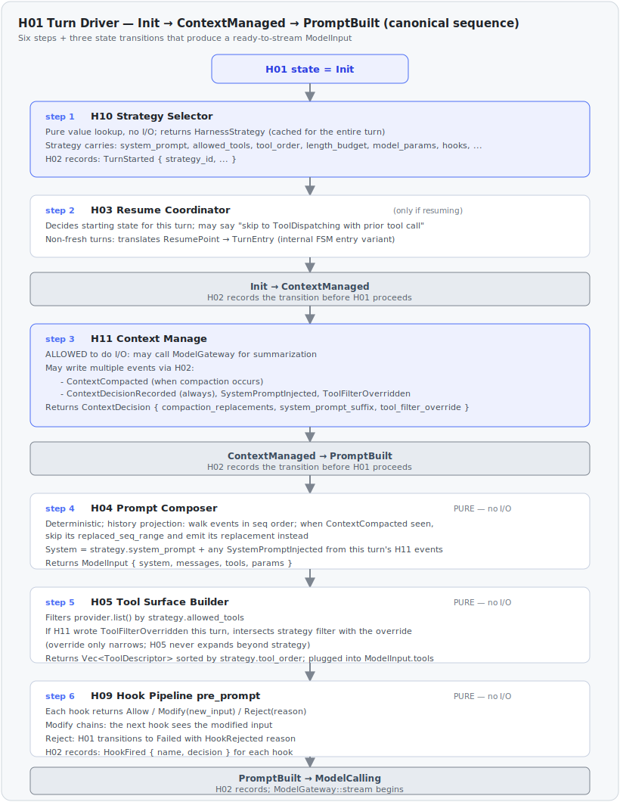

# H01 · Turn Driver

> **Status**: Implemented · FSM body + sync tool loop (Sprint 2) · resume logic + chaos test (Sprint 3) · H11 context orchestration (Sprint 6)

## Role in Harness

Drive one iteration of the agent loop as an **explicit finite state
machine**. The only coordinator inside Brain — H02 through H11 do not call
each other; H01 calls them.

## What is a Finite State Machine here?

H01 is implemented as a **finite state machine (FSM)**, not as a function
chain. Concretely:

1. **States are values, not call positions.** Each state — `Init`,
   `ContextManaged`, `PromptBuilt`, `ModelCalling`, `ModelCompleted`,
   `ToolDispatching`, `Completed`, `Paused`, `Failed` — is a Rust enum
   variant (`TurnState`) carrying the data its outgoing transition needs.
2. **Transitions are explicit.** Each transition is a function that
   consumes one state value and returns the next. The set of legal
   transitions is enforced by the type system: you cannot construct
   `TurnState::ModelCalling` without the prior `ModelInput` value, and you
   cannot accidentally re-enter a prior state without going through the
   loop.
3. **Every transition writes one event to the conversation log
   *before* moving on.** This is the load-bearing invariant from
   [ADR-0003](../adr/0003-state-machine-turn-driver.md). On crash, the
   next Brain instance reconstructs the FSM's position by replaying the
   event log — there is no other source of truth.
4. **Resume is a pure function from events.** The position the next
   instance enters is determined entirely by `replay(events)` returning
   a `ResumeDecision`; H01 does not query external state to know where
   it left off.

Why this matters in practice:

- A naive function chain (`compose → model → resolve → dispatch`) has
  no addressable mid-flight position. A crash between any two `await`s
  loses the chain's progress; you can only restart from the start.
- The FSM is the **substitute for cross-turn state**. By making each
  transition write its event, the event log itself becomes the place
  where "where are we now" lives. Adding fields to `TurnState` to
  cache things across turns is a bug, not an optimization
  (AGENTS.md §"Inviolable design principles" #3).

See ADR-0003 for the original decision and `harness::turn_driver` for
the Rust realization.

## State machine


| State | Entered when | H01 calls |
|---|---|---|
| `Init` | Turn starts (new or resumed) | H10 (strategy), H03 (resume decision) |
| `ContextManaged` | Context decisions (compaction, system-prompt overrides, tool overrides) finalized for this turn | H11 (manage); H02 records H11's decisions |
| `PromptBuilt` | Prompt + tool surface assembled | H04 (compose), H05 (surface), H09 (`pre_prompt`) |
| `ModelCalling` | ModelGateway streaming started | H06 (demux) per chunk |
| `ModelCompleted` | Stream ended with `stop_reason` | H07 (resolve tool calls), H09 (`post_model`) |
| `ToolDispatching` | One or more tool calls present | H08 (invoke), H09 (`pre_dispatch`) |
| `Completed` | Model returned `end_turn` without tools | H09 (`post_turn`) |
| `Paused` | A tool returned `InvokeOutcome::Async(JobId)` | H09 (`post_turn`); turn re-entered when job finishes |
| `Failed` | Unrecoverable error, hook `Reject`, or iteration budget exhausted | H09 (`on_error`) |

### Loop termination — stop conditions

The inner loop (`Init → … → ToolDispatching → Init`) terminates on exactly one of:

- **`Completed`** — the model returned `end_turn` with zero `tool_use` blocks.
- **`Paused`** — a tool returned `InvokeOutcome::Async(JobId)`; resumes on `JobCompleted`.
- **`Failed`** — a runtime fault (store / gateway / panic / `tokio` timeout →
  `TurnTimedOut`), a hook `Reject` (`HookRejected`), the consecutive-tool-error
  guard (`MAX_CONSECUTIVE_TOOL_ERRORS = 4`, an unproductive all-error loop), or
  the **iteration budget** (ADR-0038).

The iteration budget bounds a *productive but non-terminating* loop. `Init`
checks `ctx.model_calls >= strategy.max_turns` (default 16) before starting
another round and, if reached, records `TurnFailed { MaxTurnsExceeded { turns } }`
and stops instead of issuing the next model call. The count is the number of
model calls (`ModelCallStarted` events) made this turn — incremented in
`PromptBuilt` and **re-derived from the event log on resume** (seeded into
`TurnCtx.model_calls` at `TurnDriver` spawn) so the budget holds across
pause/resume. On-hit policy is a hard fail by design: continue / summarize are
consumer policy layered on the failure, not baked into the core (ADR-0038 §3).

> **`ContextManaged` was added 2026-05-19 by PR #6** as an ADR-0006 amendment.
> Rationale and the full H10/H11/H04/H05/H09 collaboration walkthrough are
> below in §"Init → ContextManaged → PromptBuilt sequence". Sprint 6 implements
> the real H11 work at this transition per the Context Management initiative
> (ADR-0008, Accepted); `cogito-context` ships the compactor/injector/overrider
> pipeline and `ContextManaged` is real orchestration, not a pass-through.

## Resume entry path

When `runtime::session_loop::run_session` resolves a non-`FreshTurn` resume decision (Sprint 3 P3.4+), it calls `enter_turn(turn_entry, ctx, deps)` where `turn_entry` is an internal `TurnEntry` enum translating a `ResumePoint` (which carries session-loop concerns like `turn_id`) into the FSM-level shape the FSM consumes:

```rust
pub(crate) enum TurnEntry {
    /// FSM enters Init. H04 rebuilds prompt from event log; H10 re-selects strategy.
    /// Maps from ResumePoint::RestartCurrentTurn.
    FreshLikeInit,
    /// FSM enters ModelCompleted with rebuilt output; fast-paths to Completed
    /// (no model re-call). Maps from ResumePoint::ResumeFromModelCompleted.
    FromModelCompleted { output: ModelOutput },
    /// FSM enters ToolDispatching with pending/completed pre-populated. H07
    /// re-validates pending against current schemas; H10+H05 rebuild surface.
    /// Maps from ResumePoint::ResumeFromToolDispatching AND
    /// ResumePoint::ResumeAfterJobCompletion (latter injects job outcome as
    /// the final completed entry before entering).
    FromToolDispatching {
        pending: Vec<ResumePendingCall>,
        completed: Vec<(String, ToolResult)>,
    },
}
```

`ResumePoint::FreshTurn` does not produce a `TurnEntry` — the actor idles in `mailbox` until the next `Input` triggers a fresh turn. `ResumePoint::ResumePausedJob` likewise does not spawn a TurnDriver; the actor enters `InFlight::PausedOnJob` directly and re-registers the `on_complete` callback.

`TurnEntry` lives inside `cogito-core::harness::turn_driver` and is **harness-internal** — it never crosses the protocol boundary. The protocol-visible recovery interface is `ResumePoint` (in `cogito-core::harness::resume`).

**Status: Sprint 3 P3.4 introduced `TurnEntry` and rewrote `enter_turn`**, which now translates every non-actor-level `ResumePoint` into its starting `TurnState`.

→ Sprint 3 decision: spec `2026-05-20-sprint-3-resume-coordinator-design.md` §5.3.

## Init → ContextManaged → PromptBuilt sequence (canonical)

This is the **five-component collaboration** that produces a ready-to-stream `ModelInput`. Reviewers and implementers MUST consult this when touching H04, H05, H09, H10, or H11.



<details><summary>Text version</summary>

```text
H01 in state = Init
  │
  │  step 1 ──► H10 Strategy Selector::select(model_id, task, registry)
  │             ─ pure value lookup, no I/O
  │             ─ returns HarnessStrategy { system_prompt, allowed_tools,
  │               tool_order, length_budget, model_params, hooks, ... }
  │             ─ result cached for the entire turn (used by H11, H04, H05, H09)
  │             ─ H02 records: TurnStarted { strategy_id, ... }
  │
  │  step 2 ──► H03 Resume Coordinator (if resuming)
  │             ─ decides starting state for this turn
  │             ─ may say "skip to ToolDispatching with prior tool call"
  │
H01 transitions: Init → ContextManaged   (H02 records the transition)
  │
  │  step 3 ──► H11 Context Manage::manage(ContextManageInput { strategy, ... })
  │             ─ ALLOWED to do I/O: may call ModelGateway for summarization
  │             ─ may write multiple events via H02:
  │                 · ContextCompacted (when compaction occurs)
  │                 · ContextDecisionRecorded (always — captures the decision)
  │                 · SystemPromptInjected (when overriding strategy.system)
  │                 · ToolFilterOverridden (when narrowing H05's filter)
  │             ─ returns ContextDecision { compaction_replacements,
  │                                         system_prompt_suffix,
  │                                         tool_filter_override }
  │             ─ ContextDecision is held by H01 for the rest of the turn,
  │               but H04/H05 read the equivalent information from the
  │               event log (not from the in-memory value) — this matches
  │               AGENTS.md §3 "State lives in Conversation Service".
  │             ─ Sprint 6: implemented per ADR-0008. The transition runs
  │               the compactor/injector/overrider pipeline (cogito-context),
  │               writes its events via H02, and any trait failure is captured
  │               in ContextDecisionErrors so the turn continues (never fatal).
  │
H01 transitions: ContextManaged → PromptBuilt   (H02 records the transition)
  │
  │  step 4 ──► H04 Prompt Composer::compose(history, strategy, surface)
  │             ─ PURE: deterministic, no I/O (invariant #2)
  │             ─ history projection rule: walk events in seq order, when
  │               a ContextCompacted event is encountered, skip events in
  │               its replaced_seq_range and emit its replacement instead
  │             ─ system = strategy.system_prompt + any
  │               SystemPromptInjected from this turn's H11 events
  │             ─ returns ModelInput { system, messages, tools, params }
  │
  │  step 5 ──► H05 Tool Surface Builder::surface(strategy, provider)
  │             ─ PURE: deterministic, no I/O (invariant #1/2)
  │             ─ filters provider.list() by strategy.allowed_tools
  │             ─ if H11 wrote a ToolFilterOverridden event this turn,
  │               H05 intersects its strategy filter with the override
  │               (override only narrows; H05 never expands beyond strategy)
  │             ─ returns Vec<ToolDescriptor> sorted by strategy.tool_order
  │               or by name (stable for prompt-cache hit rate)
  │             ─ output is plugged into the ModelInput.tools field
  │
  │  step 6 ──► H09 Hook Pipeline::pre_prompt(ModelInput, hooks)
  │             ─ PURE: hooks may not do I/O (AGENTS.md §6 + H09 doc)
  │             ─ each hook returns Allow / Modify(new_input) / Reject(reason)
  │             ─ Modify chains: the next hook sees the modified input
  │             ─ Reject: H01 transitions Init → Failed with HookRejected reason
  │             ─ H02 records: HookFired { name, decision } for each hook
  │
H01 transitions: PromptBuilt → ModelCalling   (H02 records; ModelGateway::stream begins)
```
</details>

**Responsibility matrix**:

| Component | Sees strategy? | Sees history? | May do I/O? | Output |
|---|:-:|:-:|:-:|---|
| H10 Strategy Selector | (produces it) | ✗ | ✗ | `HarnessStrategy` value |
| H11 Context Manage | ✓ | ✓ | ✓ (model call) | `ContextDecision` + persisted events |
| H04 Prompt Composer | ✓ | ✓ (via projection) | ✗ | `ModelInput` value |
| H05 Tool Surface Builder | ✓ | ✗ | ✗ (provider.list() is read-only) | `Vec<ToolDescriptor>` |
| H09 Hook Pipeline (`pre_prompt`) | ✓ | ✓ (via input) | ✗ | `HookDecision` per hook |

**Why H11 sits where it does**:

- **Before H04**: H04 reads history *through* H11's compaction decisions. Putting H11 after H04 would mean composing a wasteful full prompt first, then throwing parts away.
- **After H10**: H11 needs `HarnessStrategy` to know the length budget, summarization model preference, and tool-filter starting point.
- **Before H09**: hooks observe the *post-context-management* input. A hook that says "reject if prompt mentions 'reset password'" should run against the compacted, ready-to-ship prompt, not against the raw history.
- **As its own FSM state, not inline in `Init`**: because H11 does I/O (summarization can take seconds). Hiding I/O inside a transition violates ADR-0003's "each transition writes an event" intent — H03 Resume Coordinator must be able to distinguish "crashed in H10 lookup" from "crashed mid-summarization".

## Interface (design level)

- `Turn::run(req: TurnRequest) -> TurnOutcome`
- `TurnRequest { session_id, input: TurnTrigger | ResumeAfter(job_id) }` (see ADR-0016)
- `TurnOutcome { Completed | Paused { reason } | Failed { error_kind, message } }`
- Implementation is async; one in-flight turn per session at a time (enforced by Runtime, not by H01).

## Dependencies

**Calls (out)**:
- H03 Resume Coordinator — once on entry, decides starting state
- H10 Strategy Selector — once on entry, produces `HarnessStrategy` value
- H11 Context Manage — at `Init → ContextManaged`
- H04 Prompt Composer, H05 Tool Surface Builder — at `ContextManaged → PromptBuilt`
- H06 Stream Demultiplexer — during `ModelCalling`
- H07 Tool Call Resolver — at `ModelCompleted`
- H08 Tool Dispatcher — at `ToolDispatching`
- H09 Hook Pipeline — at `pre_prompt`, `pre_dispatch`, `post_model`, `post_turn`, `on_error`
- H02 Step Recorder — at **every** state transition and every meaningful sub-step
- `ModelGateway::stream(model_input, ctx)` — at `PromptBuilt → ModelCalling`

**Called by**: Runtime layer (a session task spawned by `cogito-core::runtime`).

## Critical invariants

1. **Every state transition writes an event before the transition completes.** If a crash happens after the event is durably recorded but before the next call returns, H03 must be able to reconstruct state from the event alone.
2. **Brain never propagates `Err` upward from tool / hook calls.** All failures arrive as `ToolResult::Error` or `HookDecision::Reject` and are recorded as events; only Runtime-level errors (DI failure, store I/O failure) escape as `TurnOutcome::Failed`.
3. **Panics in tools, hooks, or gateways are caught at the Runtime boundary** (panic-catch around the H01 task). A panic fails one turn; it never brings down the process.
4. **Same session may be entered by another Brain instance after crash.** H03 alone decides where to resume; H01 must accept that decision and start from there without checking external state.
5. **Tools dispatched sequentially in v0.1.** Parallel dispatch is a 0.x option gated by a strategy flag.

## Open design questions

- Pause semantics for the consumer: does the consumer see `Paused { job_id }` and decide whether to await/cancel, or does the Runtime auto-resume on `JobCompleted`? Initial answer: Runtime auto-resumes via a subscription to `JobManager`; consumer just polls turn state.
- Multiple tool calls in one model response: dispatch order = order emitted by model. If one fails, do remaining tools still run? Initial answer: yes (all dispatched, each gets its own `ToolResult`); the model decides next turn based on full result set.
- **Context management mechanism** — resolved by ADR-0008 (Context Management initiative, Accepted) and implemented in Sprint 6. H11 lives at the `Init → ContextManaged` transition, is allowed to do I/O, and writes its own events via H02 (`ContextCompacted`, `SystemPromptInjected`, `ToolFilterOverridden`, `ContextDecisionRecorded`, `ContextManageCompleted`). The compactor/injector/overrider traits live in `cogito-protocol::context` with reference implementations in `cogito-context`. See `docs/components/H11-context-manage.md`.

## Testing strategy

- **Unit**: each state-transition function tested in isolation with mocked dependencies (`MockToolProvider`, `MockModelGateway`, in-memory store).
- **Integration**: full turn against scripted mock model + scripted tool provider; verify the event sequence matches the golden trace.
- **Chaos** (`crates/cogito-core/tests/resume_chaos.rs`): inject a crash between every adjacent pair of events; on restart, H03 + H01 must reach a semantically equivalent end-state.
- **Property**: arbitrary turn scripts produce event sequences that satisfy "every state transition is preceded by its corresponding event".

## References

- ARCHITECTURE.md §"Turn state machine"
- ADR-0003 (state-machine Turn Driver)
- AGENTS.md §"Inviolable design principles" #1, #3, #4

## Implementation note (v0.1)

### Three layers of "TurnDriver"

The name **TurnDriver** appears at three different abstraction levels.
Keeping them straight when reading code:

| Layer | Name | What it is |
|---|---|---|
| Design concept | "H01 Turn Driver" (Title Case) | The 11-component-Brain abstraction; this doc. Not a Rust entity. |
| Rust implementation | `cogito_core::harness::turn_driver` module (snake_case) | The module that realizes H01. Contains `TurnState`, `TurnCtx`, `TurnDeps`, `run()`, `enter_turn()`, and the `transitions/*` submodules. |
| tokio runtime entity | "TurnDriver task" | A per-turn `tokio::spawn`-ed task that runs `enter_turn(...)`. The per-session loop tracks it via `SessionState::InFlight::Active` (with the turn-result `mpsc` sender to signal completion). One task = one turn. |

A reader saying "the TurnDriver crashed" almost always means the task;
a reader saying "TurnDriver decides X" almost always means the
component / module. `run()` itself is not "the TurnDriver" — it is the
loop body inside the module.

### Module structure (Sprint 2)

```
crates/cogito-core/src/harness/turn_driver/
├── mod.rs                 # pub use; defines run() + enter_turn()
├── state.rs               # TurnState enum + TurnCtx struct + ResumeDecision (re-export)
├── deps.rs                # TurnDeps (container of injected protocol trait objects)
└── transitions/
    ├── mod.rs
    ├── init.rs                  # transit_init_to_context_managed
    ├── context_managed.rs       # transit_context_managed_to_prompt_built (Sprint 6: H11 pipeline)
    ├── prompt_built.rs          # transit_prompt_built_to_model_calling (calls H04 + H05 + H09 pre_prompt)
    ├── model_calling.rs         # transit_model_calling_to_model_completed (drives stream via H06)
    ├── model_completed.rs       # transit_model_completed_to_dispatching_or_completed (calls H07)
    └── tool_dispatching.rs      # transit_tool_dispatching_step (calls H08 sync path)
```

`TurnCtx` carries turn-lifetime invariants shared by every transition:

```rust
#[derive(Clone)]
pub struct TurnCtx {
    pub session_id: SessionId,
    pub turn_id: TurnId,
    pub exec_ctx: ExecCtx,
    pub strategy: HarnessStrategy,
}
```

The discipline for `TurnCtx`: only fields that are (a) unchanged for the
entire turn AND (b) read by at least 3 transitions. Anything narrower
stays inside the relevant variant.

### Call graph

```
session_loop::handle_command(Input { text })     [runtime/session_loop.rs]
  │
  ├── ctx     = TurnCtx { session_id, turn_id, exec_ctx, strategy }
  ├── deps    = TurnDeps { step, model, tools, broadcast, ... }
  ├── decision = h03::replay(&events_so_far)?    // Sprint 3: full decision table
  └── tokio::spawn( turn_driver::enter_turn(decision, ctx, deps) )
        │                              ↓
        │                      JoinHandle<TurnOutcome>
        │                              ↓
        └─→  state.in_flight = Some(InFlight::Active { turn_join, started_at })

  ──── inside the spawned task ────

turn_driver::enter_turn(decision, ctx, deps)     [harness/turn_driver/mod.rs]
  │
  ├── initial: TurnState = match decision { /* ResumeDecision → TurnState */ }
  └─→ turn_driver::run(initial, &deps)
        │
        └── loop {
              state = match state {
                TurnState::Init { ctx, resume }                              => transitions::init::transit(...).await,
                TurnState::ContextManaged { ctx, context_decision }          => transitions::context_managed::transit(...).await,
                TurnState::PromptBuilt { ctx, input, surface }               => transitions::prompt_built::transit(...).await,
                TurnState::ModelCalling { ctx, stream, accumulator, surface }=> transitions::model_calling::transit(...).await,
                TurnState::ModelCompleted { ctx, output, surface }           => transitions::model_completed::transit(...).await,
                TurnState::ToolDispatching { ctx, pending, completed, surface } => transitions::tool_dispatching::transit(...).await,
                terminal => break terminal.into_outcome(),
              };
            }

  ──── task completes; the session loop's select! wakes on turn_result ────

session_loop::on_turn_complete(TurnOutcome)      [back in runtime/session_loop.rs]
```

### Loop topology

`TurnDeps` (carrying `tools` / `skills` / `model`) is **rebuilt on every
turn** from the session actor's `SessionState`. This is the mechanism
behind per-session, mid-session-mutable providers (ADR-0028): a
`SessionCommand::UpdateSession` swaps the Arcs in `SessionState`, and the
next `spawn_turn_driver` picks them up — so a provider change lands at the
next turn boundary, never mid-turn. H01 reads providers only through
`TurnDeps` and is otherwise unaware of their origin or lifetime.

A single TurnDriver task = one `input → final answer or paused` cycle.
Multi-turn tool loops are an **inner** loop within the FSM — after
`ToolDispatching` completes all sync calls, the FSM re-enters
`Init` (with a new `turn_id`) to compose another prompt with the tool
results appended. A paused turn ends the current task; it is later
resumed by *another* TurnDriver task that starts at
`TurnState::ToolDispatching` (carrying the now-completed job's result).
The per-session loop coordinates that handoff via mailbox-injected
`JobCompleted`.

### References

See `docs/superpowers/specs/2026-05-18-runtime-h01-execution-model-design.md`
§5 for the FSM pseudocode and the load-bearing decisions in
[ADR-0006](../adr/0006-runtime-h01-execution-model.md).
The Sprint 2 design discussion that locked the Hybrid `TurnCtx`,
single-`run()` match, and `enter_turn`-as-resume-translator decisions
lives in `docs/superpowers/specs/2026-05-19-sprint-2-minimal-loop-design.md`
§"Q5 · TurnState FSM 表达".
