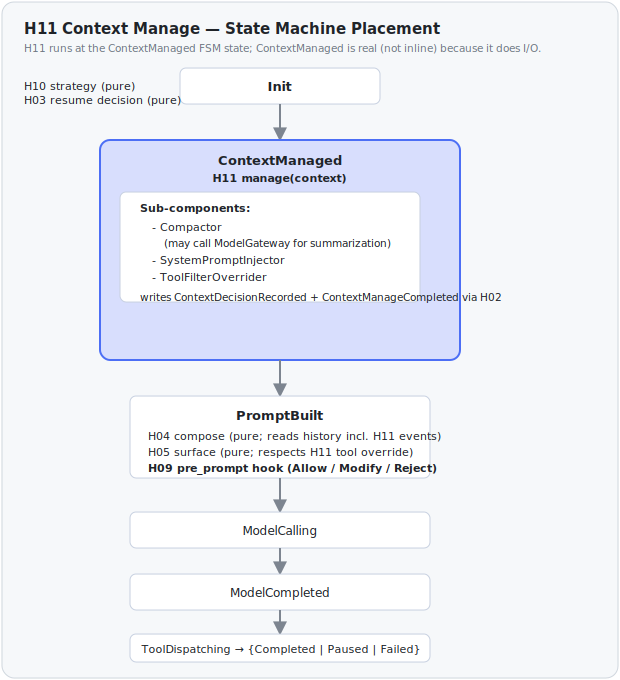

# H11 · Context Manage

> **Status**: Implemented in v0.1 Sprint 6 (see ADR-0008)

## Why this component exists

Three observations forced H11 to exist:

1. **H04 Prompt Composer is pure** (`invariant #2: no I/O`, see H04 doc). It cannot perform summarization-based compaction because summarization requires a model call.
2. **H05 Tool Surface Builder is pure and strategy-static**. It cannot perform context-aware tool injection (e.g., "drop the `write_file` tool because we're in a read-only review subtask").
3. **H10 Strategy Selector is even more passive** — it produces a `HarnessStrategy` value and never speaks again.

Yet every production agent must, at some point per turn, **decide what context the model should see**: how much history to include, whether to summarize, what system context to inject, which tool subset is appropriate now. Without a dedicated home for these decisions, they leak into H04 (breaking its pure-function invariant) or into the consumer's calling code (breaking encapsulation).

H11 is that home. It sits **between H10 (strategy lookup) and H04 (passive composition)** in the Init → ContextManaged → PromptBuilt sequence, and is allowed to do I/O (model calls for summarization), which H04/H05/H10 are not.

## Role in Harness

Decide, for the turn that is about to start, the **context shape** that H04 will then mechanically render into a `ModelInput`. Context shape covers:

- **History compaction**: do we need to compact old events? Which seq-range does it supersede?
- **System prompt injection**: any per-turn additions on top of `strategy.system_prompt`.
- **Tool surface override**: any per-turn restriction beyond what H05 would produce from strategy alone.

H11 orchestrates four traits in a fixed order each `ContextManaged` transition, persisting structured events for each step.

## v0.1 implementation

Full design rationale, pseudocode, and test plan: **ADR-0008** (`docs/adr/0008-context-management.md`).

Sprint 6 spec: `docs/superpowers/specs/2026-05-23-sprint-6-context-management-design.md`.

### Four-trait surface

H11's protocol surface (`cogito-protocol::context`) defines four traits with distinct invariants:

1. **`Compactor`** — async, may do I/O (including model calls for summarization). Writes 0 or 1 `ContextCompacted` event per turn via `StepRecorder`. Failures degrade: H11 records the error but does not block the turn.

2. **`HistoryProjector`** — pure synchronous function. Projects the event log to `Vec<Message>` for `ModelInput`. Implements the set-union covered-range semantics from ADR-0008 §"Projection semantics". No I/O, no event writes. Invoked by H04, not by H11's orchestration pipeline.

3. **`SystemPromptInjector`** — async (filesystem I/O needed by Sprint 7 Skill loader). Computes a per-turn system-prompt suffix and persists exactly one `SystemPromptInjected` event per turn, even when the suffix is empty (audit invariant).

4. **`ToolFilterOverrider`** — async. Decides a per-turn tool filter override on top of `strategy.allowed_tools` and persists exactly one `ToolFilterOverridden` event per turn, even when the decision is `Inherit`.

Merging any two traits would violate one side's invariant; see ADR-0008 §"Alternatives considered" for the full analysis.

### v0.1 shipped implementations

| Slot | v0.1 implementation | Config tag |
|---|---|---|
| Compactor | `NoneCompactor`, `TruncateCompactor` | `none`, `truncate` |
| HistoryProjector | `StandardProjector` | `standard` |
| SystemPromptInjector | `NoneInjector`, `SkillInjector` (Sprint 7) | `none`, `skill` |
| ToolFilterOverrider | `NoneOverrider` | `none` |

Sprint 7 added `SkillInjector` alongside `NoneInjector` under the
`SystemPromptInjector` slot. It is the authoritative landing point for skill
activations: it consumes pending `SkillActivationRequested` triggers (from H06
sigil detection in the previous turn, or from a CLI `/skill <name>` command),
loads the corresponding SKILL.md bodies via the injected `SkillProvider`, and
emits a deduplicated `SkillActivated` event plus the appended system-prompt
suffix. Cross-turn dedup is anchored on `(session_id, skill_name)`. See
`docs/adr/0020-skill-loader.md` and
`docs/superpowers/specs/2026-05-23-sprint-7-skill-loader-design.md` for the
end-to-end design.

Each activated skill is injected as a `<skill name="..." source="...">` block
wrapping its SKILL.md body. Per ADR-0029, when `SkillContent.root` is `Some`
(any on-disk skill) the block also carries a `root="<abs-dir>"` attribute and a
one-line hint, so the model can resolve relative references in the body
(`scripts/`, `references/`, `assets/`) against the skill's own directory. The
path is resolved fresh from the `SkillProvider` at injection time and is never
persisted in the event log (absolute paths are machine-specific; ADR-0007).

### Orchestration order

Each `ContextManaged` transition H11 runs in this fixed order:

1. Compactor — may write 0 or 1 `ContextCompacted` event.
2. SystemPromptInjector — always writes 1 `SystemPromptInjected` event.
3. ToolFilterOverrider — always writes 1 `ToolFilterOverridden` event.
4. H11 writes `ContextDecisionRecorded` — the summary index for the turn.
5. H11 writes `ContextManageCompleted` — FSM transition marker.

A trait failure degrades: the error is captured in `ContextDecisionRecorded.errors`; only a failure of H11's own fallback write propagates up and causes `TurnFailed`.

## State machine placement



`ContextManaged` is a real FSM state (not an inline call) because:

- **It does I/O** (summarization model call) — possibly long-running.
- **It must be resumable**: H03 needs to know if a crash happened mid-summarization, so H11 transitions must be visible to the event log.
- **It writes its own events** to the log, which H04 and H05 then read to compose the prompt.

## Resume / idempotency

No new `ResumePoint` variant is needed. H03 handles a `ContextManageEntered` with no paired `ContextManageCompleted` by choosing `ResumeFromInit`, which re-runs the `ContextManaged` transition. All three H11-orchestrated traits are idempotent on `turn_id`: each checks whether its event already exists in history before doing work. See ADR-0008 §"Resume / idempotency" for details.

## Configuration

`HarnessStrategy.context: ContextConfig` holds four tagged-config enums:

```
ContextConfig {
    compactor:              CompactorConfig,              // none | truncate
    history_projector:      HistoryProjectorConfig,       // standard
    system_prompt_injector: SystemPromptInjectorConfig,   // none
    tool_filter_overrider:  ToolFilterOverriderConfig,    // none
}
```

Each enum is `#[non_exhaustive]` with `#[serde(tag = "kind")]`. The factory `cogito_context::build_pipeline(&ContextConfig)` lives in `cogito-context` (the crate that owns the implementations), following CLAUDE.md "Tagged-config factories" rule.

## Crate layout

- `cogito-protocol::context` — trait definitions, `ContextPipeline`, config types, shared value types.
- `cogito-context` — no-op defaults, `TruncateCompactor`, `StandardProjector`, and the `build_pipeline` factory.
- `cogito-core::harness` — H11 `transitions/context_managed.rs` calls through the pipeline; H04 uses `HistoryProjector`; H05 reads `ToolFilterOverridden` events.

## Dependencies

**Calls (out)**:

- `Compactor::maybe_compact` — checks token budget; may call `ModelGateway::stream` for summarization.
- `SystemPromptInjector::inject` — computes per-turn suffix.
- `ToolFilterOverrider::override_filter` — decides per-turn tool filter.
- `StepRecorder` — persists all four context-decision events.

**Called by**: H01 Turn Driver, at the `Init → ContextManaged` transition.

**Does NOT call**: H04, H05, H07, H08, H09 (per AGENTS.md §1 "H01 is the only coordinator").

## Critical invariants

1. **Brain-side**. Lives in `cogito-core::harness`. Imports `cogito-protocol` only.
2. **Recorder pass-through**. H11 writes events through H02 (`StepRecorder`). H11 does NOT acquire its own `Arc<dyn ConversationStore>` outside of H02 — Storage stays single-writer per session.
3. **ModelGateway access is summarization-only**. H11 may call `ModelGateway::stream` for summarization, but the result is NEVER persisted as `AssistantMessageAppended`. Summarization output is persisted as `ContextCompacted.replacement`.
4. **Decisions are turn-scoped**. `ContextDecisionRecorded` applies to the current turn only. The next turn's H11 invocation re-decides from scratch.
5. **No cross-turn state in H11 struct fields**. State lives in the event log (AGENTS.md §3). H11 may have read-only configuration injected at construction.

## Testing strategy

- **Unit**: each decision branch (no-op, compact-needed, system-prompt-override, tool-override) tested with mocked `ModelGateway` and in-memory store.
- **Integration**: full turn through Init → ContextManaged → PromptBuilt against a scripted compaction scenario. See `crates/cogito-core/tests/context_managed_with_truncate.rs`.
- **Chaos**: inject crash between every event H11 writes; H03 must recover correctly. See `make chaos`.
- **Fixture**: `crates/testing/cogito-test-fixtures/fixtures/sessions/sample-truncate-v1.jsonl` illustrates a session with one truncate compaction event.

## References

- ADR-0008 (`docs/adr/0008-context-management.md`) — full design discussion and alternatives
- ADR-0003 (state-machine Turn Driver)
- ADR-0004 (Brain / Hands / Session boundaries)
- ADR-0006 (Runtime + H01 execution model; `ContextManaged` state originally reserved here)
- ADR-0007 (event log forward-compat; additive variant precedent)
- H01 Turn Driver doc §"Init → ContextManaged → PromptBuilt sequence"
- H04 Prompt Composer doc §"Sprint 6: HistoryProjector dispatch"
- H05 Tool Surface Builder doc §"Sprint 6: ToolFilterOverridden integration"
- `docs/data-model/jsonl-v1.md` §"Context management events"
