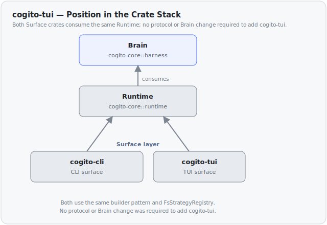

# cogito-tui — Surface

Single-column ratatui terminal UI with `▸` / `∴` role markers and
inline expandable tool blocks (no tools pane, no persistent status
bar). Peer to `cogito-cli` in the Surface layer (ADR-0004). Not a
Harness component (no H-number).

## Position

Both Surfaces consume the same Runtime via the same builder pattern
and the same `FsStrategyRegistry`. No protocol or Brain change was
required to add cogito-tui.

## Module map

- `cli.rs` — `TuiArgs` (clap-derived flag surface, mirrors `ChatArgs`)
- `app.rs` — `App` state (single source of truth)
- `render_model.rs` — `ChatModel` + `ToolTreeModel` (sink-agnostic)
- `ui/` — widgets (chat, input, popup, spinner, banner) + top-level
  single-column `render`
- `keymap.rs` — `dispatch(app, key) -> Action`
- `slash.rs` — `parse + dispatch` for `/skill <name>`
- `resume.rs` — `ConversationEvent → StreamEvent` translation +
  `extract_tool_result` for lazy lookup
- `runtime_build.rs` — Runtime + Session assembly (mirrors
  `cogito-cli::chat::run`'s prelude)
- `event_loop.rs` — `select!` over crossterm / stream / 33ms tick
- `terminal.rs` — `TerminalGuard` (RAII + panic hook + signals)
- `logs.rs` — gated `RUST_LOG`-driven file logger

## Markdown rendering

Assistant replies (`ChatLine::AssistantText`) are parsed with
`pulldown-cmark` at draw time and rendered into styled ratatui `Line`
spans by the `ui::markdown` module.

Supported inline and block elements:

- Bold and italic via ratatui `Modifier::BOLD` / `Modifier::ITALIC`.
- Inline code in yellow.
- Fenced and indented code blocks rendered dim.
- Bullet and numbered lists, including one level of nesting. List
  markers (`-` / `N.`) are rendered in the cogito green.

Elements that degrade to plain text:

- Headings — rendered as unstyled text (no `#` prefix).
- Block quotes — content kept, `>` marker dropped.
- Links — label kept, URL dropped.

Module responsibilities:

- `ui::markdown` is pure: it knows nothing about role markers or
  gutter indentation.
- `ui::chat` prepends the `∴` marker on the first rendered line and a
  3-space gutter on all continuation lines, exactly as it does for
  plain text.

Per-frame re-parse is intentional. `ChatModel` is reprojected from the
event log on every frame; adding an incremental projection layer is a
separate deferred sprint. Parsing overhead is negligible for typical
reply lengths.

Only assistant text is markdown-rendered. Thinking output, user
prompts, system notices, and tool args / result previews remain raw
text (markdown rendering for those is deferred).

Spec: `docs/superpowers/specs/2026-05-29-cogito-tui-markdown-design.md`
Plan: `docs/superpowers/plans/2026-05-29-cogito-tui-markdown.md`

## Key contracts

- **Lazy palette**: `ChatLine` stores raw text + structural variant;
  widgets paint at render time. A `ChatLine::ToolBlock { call_id }`
  carries no state — the chat renderer looks up the live `ToolNode` in
  `ToolTreeModel` by `call_id` at draw time and paints the lifecycle
  glyph (`⠋ ✓ ✗ ▸ ▾`).
- **Lazy tool-result lookup**: a tool block's result preview is
  populated on first expand (`Ctrl-Enter` / `Alt-N`) via
  `ConversationStore::read_session`.
- **Thinking spinner**: `App.current_turn_thinking` (set on
  `TurnStarted`, re-armed after `ToolDispatchEnded`, cleared by the
  next content event or any terminal event) drives a `∴ ⠋` line.
- **Modifier-gated commands**: all printable keys reach the input;
  tool commands use modifiers (`Ctrl-E` expand-all, `Ctrl-L`
  collapse-all, `Alt-1..9` quick-expand) so typing is never captured.
- **State regeneratable from JSONL**: `apply_stream_event` runs the
  same in live and replay modes.
- **Drawing only on tick**: 33ms interval bounds CPU; key/stream
  handlers mutate state but never `draw`.
- **Three-layer terminal restore**: RAII Drop + panic hook + SIGTERM
  handler. SIGKILL unhandleable.

## Local execution safety (ADR-0037)

`runtime_build.rs` opts the TUI into a local hardening layer by default, since
`bash` is on by default here and runs through the non-isolating
`DirectExecutor`:

- `local_safety_hooks()` injects the builtin `CommandGuardHook` via
  `RuntimeBuilder::hooks(...)` — a `pre_dispatch` denylist that blocks
  catastrophic shell commands (recursive-force `rm` on root/home/system paths,
  fork bomb, `mkfs`, `dd of=/dev/...`, block-device redirects, `chmod -R /`).
  It is an accident guard, **not a security boundary**.
- `harden_sandbox_env(...)` sets `EnvPolicy::Allowlist(default_safe_env_allowlist())`
  on the `Direct` sandbox so model-authored `bash` starts from a scrubbed
  environment (curated allowlist; host secrets default-denied).

Multi-tenant isolation and credential brokering are out of scope here and stay
deferred (ADR-0012 / ADR-0013).

## Where things live (other docs)

- Spec (current, v0.2 redesign):
  `docs/superpowers/specs/2026-05-29-cogito-tui-redesign-design.md`
- Plan (current, v0.2 redesign):
  `docs/superpowers/plans/2026-05-29-cogito-tui-redesign.md`
- Spec (original v0.1 multi-pane, superseded):
  `docs/superpowers/specs/2026-05-28-sprint-9b-tui-design.md`
- Plan (original v0.1, superseded):
  `docs/superpowers/plans/2026-05-28-sprint-9b-tui.md`
- ROADMAP entry: §"Sprint 9b · TUI"
- Strategy registry consumed by TUI: ADR-0026
- Runtime config TUI consumes: ADR-0017 §"Surface boundaries"
- MCP banner contract: ADR-0018 §3.5.3
