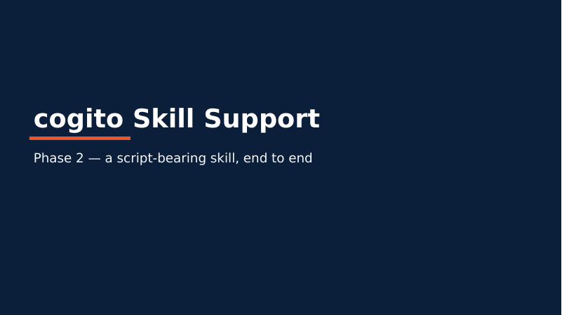
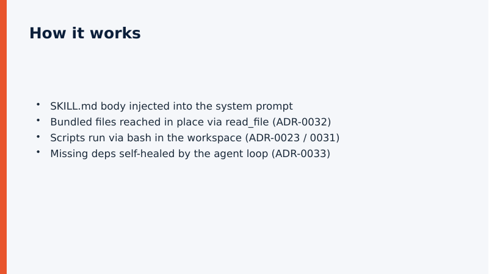

# Skill Support — Phase 2 end-to-end validation

Date: 2026-06-02
Scope: complete-skill-support design
(`docs/superpowers/specs/2026-06-01-complete-skill-support-design.md`) Phase 2.
Related ADRs: 0029, 0030, 0031, 0032, 0033, and 0023 (finalized here).

## Hypothesis

A **script-bearing skill** authored to the agentskills.io standard (SKILL.md +
bundled `scripts/`) can be driven end to end by cogito — its instructions
injected, its bundled files reached in place, its scripts run, and an artifact
produced — **with zero Brain change**, purely by composing the Hands seams added
in Phases 0–2. Concretely: the `pptx` skill can produce a real, openable `.pptx`.

## Method

Two complementary checks.

### 1. Real skill, manual agent drive (the concrete goal)

Acting as the agent, I followed the actual `pptx` skill at
`compass/skills/skills/pptx` along its documented **"create from scratch"** path
(`pptxgenjs.md`):

1. **Reach / read** the skill's guidance (`SKILL.md`, `pptxgenjs.md`).
2. **Dependency self-heal** (ADR-0033 Local path): the host had `node`, `npm`,
   `python3`, `libreoffice`, but **not** the `pptxgenjs` package. As the agent
   loop would, I installed it into a disposable scratch workspace
   (`npm install pptxgenjs`, 19 packages, ~2 s) — **not** the global host.
3. **Author + run**: wrote a 2-slide deck per the guide's API
   (`data/skill-support-phase2/make_deck.js`) and ran `node make_deck.js`.
4. **Validate**: confirmed the output is a valid OOXML package and **opens** by
   rendering it to PDF with LibreOffice (the skill's own `thumbnail.py` path uses
   LibreOffice/soffice).

### 2. cogito machinery, automated (the "zero Brain change" claim)

Verified the full Phase-2 stack is wired on both surfaces and added a capstone
acceptance test that drives the chain through the **Runtime** with a mock model:

- New test `crates/cogito-jobs/tests/skill_script_e2e.rs`: a skill bundle outside
  the workspace; one turn `read_file`s a bundled script by its absolute skill-root
  path, then `bash`-runs it with no `cwd`. Asserts (a) `read_file` returned the
  script source, (b) `bash` captured its stdout, (c) the artifact landed **in the
  workspace root**, not the bundle.

## Data

### Real `pptx` run

| Item | Value |
|---|---|
| Skill | `compass/skills/skills/pptx` (agentskills.io SKILL.md + `scripts/` + guides) |
| Path taken | "create from scratch" → `pptxgenjs` (Node) |
| Missing dep | `pptxgenjs` — self-healed into scratch workspace (not global) |
| Output | `cogito-skill-support.pptx`, 2 slides, 53 077 bytes |
| OOXML check | `ppt/presentation.xml`, `ppt/slides/slide1.xml`, `ppt/slides/slide2.xml` present |
| Opens? | Yes — LibreOffice renders both slides to PDF (28 758 bytes) |

Rendered slides (reproducible input: `data/skill-support-phase2/make_deck.js`):

### cogito stack — seam coverage

| Seam | Mechanism | ADR | Test |
|---|---|---|---|
| Instruction injection | SKILL.md body → system-prompt suffix | 0020/0029 | `cogito-core/tests/h11_skill_injection.rs` |
| Bundle root to model | `<skill root="...">` header | 0029 | (injector) |
| Reach bundled files | `read_file`/`list_dir` → `ExecCtx.skill_roots` | 0032 | `cogito-core/tests/skill_roots_e2e.rs` |
| Run scripts | `bash` via `CommandExecutor` | 0023/0027 | `cogito-jobs/tests/bash_e2e.rs` |
| Output in workspace | no `cwd` → workspace root | 0031 §5 | `cogito-jobs/tests/bash_tool.rs` |
| **Full chain** | read bundled script → run → artifact in workspace | 0023+0031+0032 | **`cogito-jobs/tests/skill_script_e2e.rs`** (new) |
| Dependencies | agent self-heal (Local) / image (SaaS) | 0033 | (this report, §1) |

Both surfaces (`cogito-cli` chat, `cogito-tui`) register `read_file`, `write_file`,
`list_dir`, `edit`, `grep`, `glob`, `web_fetch`, `bash`, a `LocalWorkspace` rooted
at cwd, and the skill provider with `skill_roots` — so the chain above is live in
the shipped binaries, not just in tests.

## Result

**Hypothesis confirmed.** A script-bearing skill runs end to end with zero Brain
change: the `pptx` skill produced a valid, openable 2-slide deck via its own
documented path, and the cogito machinery that a live model would drive
(inject → reach → run → artifact-in-workspace) is wired on both surfaces and
covered by an automated end-to-end test. The only "missing dependency" moment was
handled exactly as ADR-0033 prescribes for Local — the agent self-healed via
`bash`, no cogito descriptor or preflight needed.

Caveat: a fully autonomous run inside `cogito chat` was not exercised here because
no model API key is configured in this environment; the mock-model acceptance test
plus the manual real-skill run together cover the same chain.

## Phase 2 close-out

Gaps identified during review and closed by this work:

- **ADR-0023 finalized** to Position A (was a deliberate deferral placeholder).
- **Spec reconciled**: §4 capability table + §6 phase table + §7 ledger now match
  what shipped (reachability not "materialization"; no dependency descriptor).
- **This report** — the experiment record the project's completion checklist
  requires.

## Implications / what's next

Deferred to **Phase 3 (v0.4 SaaS-ready)** by design, not gaps: sandbox executor
(ADR-0012) + `SandboxWorkspace`, the ADR-0032 SaaS physical-placement realization,
the ADR-0033 SaaS activation gate + safe cogito-driven auto-install, credential
isolation (ADR-0013) + `TenantContext` (ADR-0014), and `StorageSystem` +
`ArtifactProduced` for binary artifact delivery (Phase 4, v0.5). Under SaaS, the
deck's bytes would return as a `blob://` artifact rather than a workspace file.
